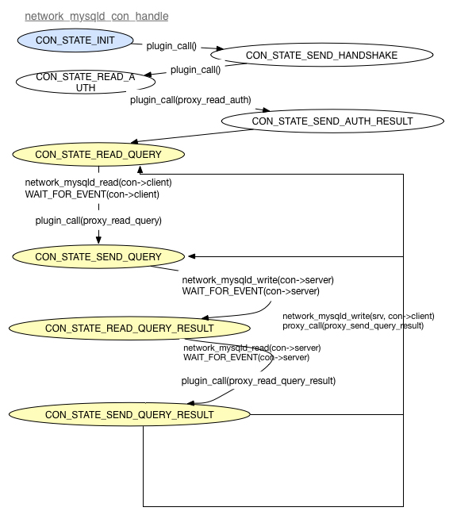
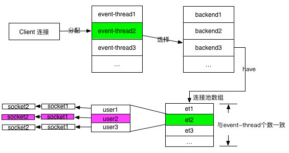

## 编译/安装/运行

详见[快速入门手册](./QUICK_START.md) 对应章节

## 源码简介

### 调试
#### 添加log
    g_message/critical/debug/...，参数与printf完全一致，级别可以动态设置，set log-level, 日志文件位置$log_path/$instance.log
#### gdb调试
##### 1. 运行时调试  
- 获取DBProxy进程号 

```
ps -ef|grep proxy
```

- attach DBProxy进程

```
gdb -p [pid]
```

- 设置断点   

```
break [断点]
```

- 程序继续运行   

```
continue
```

- 断点触发   

- 调试   

##### 2. 启动时调试  
- 启动   

```
gdb [安装路径]/bin/mysql-proxy
```

- 设置参数   

```
set args --defaults-file=[配置文件绝对路径]
```

- 设置断点  

- 程序运行   

```
run
```
- 断点触发

- 调试


### 代码文件含义

<table>
<tr>
<th>文件名</th>
<th>作用</th>
<th>使用频率</th>
</tr>

<tr>
<td><B>autogen.sh</B></td>
<td>用于生成configure文件，修改Makefile.am时使用，通常用于新加文件，修改版本</td>
<td>中</td>
</tr>
<tr>
<td><B>lib/admin.lua</B></td>
<td>admin接口的命令分析文件，与admin接口相关的命令都需要修改这个文件</td>
<td>高</td>
</tr>
<tr>
<td>plugins/admin/admin-plugin.c</td>
<td>实现admin接口的功能</td>
<td>高</td>
</tr>
<tr>
<td>plugins/proxy/proxy-percentile.c <p> plugins/proxy/proxy-percentile.h</td>
<td>实现percentile功能</td>
<td>中</td>
</tr>
<tr>
<td><B>plugins/proxy/proxy-plugin.c</B> <p>
<B>plugins/proxy/proxy-plugin.h</B>
</td>
<td>实现proxy功能的主要文件</td>
<td>高</td>
</tr>
<tr>
<td>plugins/proxy/proxy-sql-log.c<p>
plugins/proxy/proxy-sql-log.h</td>
<td>实现proxy的SQL日志管理</td>
<td>中</td>
</tr>
<tr>
<td>script/encrypt.c</td>
<td>加密程序</td>
<td>低</td>
</tr>
<tr>
<td><B>script/source.cnf.samples</B></td>
<td>模板配置文件，参数改变后需要修改此文件</td>
<td>低</td>
</tr>
<tr>
<td><B>src/chassis-event-thread.c</B><p>
<B>src/chassis-event-thread.h</B></td>
<td>工作线程的定义，调度，回收</td>
<td>高</td>
</tr>
<tr>
<td>src/chassis-exports.h</td>
<td>定义chassis库的导出函数</td>
<td>低</td>
</tr>
<tr>
<td>src/chassis-filemode.c <p>
src/chassis-filemode.h</td>
<td>设置chassis文件的权限</td>
<td>低</td>
</tr>
<tr>
<td>src/chassis-filter.c <p>
src/chassis-filter.h</td>
<td>实现过滤功能</td>
<td>中</td>
</tr>
<tr>
<td>src/chassis-frontend.c <p>
src/chassis-frontend.h</td>
<td>参数读取模块，处理命令行参数和配置文件中的参数</td>
<td>中</td>
</tr>
<tr>
<td>src/chassis-gtimeval.c <p>
src/chassis-gtimeval.h</td>
<td>时间处理</td>
<td>低</td>
</tr>
<tr>
<td>src/chassis-keyfile.c <p>
src/chassis-keyfile.h</td>
<td>配置文件处理</td>
<td>低</td>
</tr>
<tr>
<td>src/chassis-limits.c <p>
src/chassis-limits.h</td>
<td>处理proxy的资源限制功能，如文件句柄个数</td>
<td>低</td>
</tr>
<tr>
<td>src/chassis-log.c <p>
src/chassis-log.h</td>
<td>管理日志处理</td>
<td>中</td>
</tr>
<tr>
<td><B>src/chassis-mainloop.c</B> <p>
<B>src/chassis-mainloop.h</B></td>
<td> 1. 定义核心数据结构 chassis
 2. 定义了启动及运行的主流程
</td>
<td>高</td>
</tr>
<tr>
<td>src/chassis-options-utils.c <p>
src/chassis-options-utils.h</td>
<td>参数处理函数</td>
<td>高</td>
</tr>
<tr>
<td>src/chassis-options.c <p>
src/chassis-options.h</td>
<td>参数处理模块</td>
<td>中</td>
</tr>
<tr>
<td>src/chassis-path.c <p>
src/chassis-path.h</td>
<td>路径处理</td>
<td>低</td>
</tr>
<tr>
<td>src/chassis-plugin.c<p>
src/chassis-plugin.h</td>
<td>插件管理</td>
<td>中</td>
</tr>
<tr>
<td>src/chassis-shutdown-hooks.c <p>
src/chassis-shutdown-hooks.h</td>
<td>声明退出时的回调函数</td>
<td>低</td>
</tr>
<tr>
<td>src/chassis-stats.c <p>
src/chassis-stats.h</td>
<td>未知，目前未用到</td>
<td>低</td>
</tr>
<tr>
<td>src/chassis-timings.c <p>
src/chassis-timings.h</td>
<td>chassis_timestamp_t结构体声明</td>
<td>低</td>
</tr>
<tr>
<td>src/chassis-unix-daemon.c <p>
src/chassis-unix-daemon.h</td>
<td>实现daemon和keepalive功能</td>
<td>低</td>
</tr>
<tr>
<td>src/chassis-win32-service.c <p>
src/chassis-win32-service.h</td>
<td>window平台服务配置，目前没有使用</td>
<td>低</td>
</tr>
<tr>
<td>src/disable-dtrace.h</td>
<td>trace接口定义</td>
<td>低</td>
</tr>
<tr>
<td>src/glib-ext-ref.c</td>
<td>未知，使用频率低</td>
<td>低</td>
</tr>
<tr>
<td>src/glib-ext-ref.h</td>
<td>未知，使用频率低</td>
<td>低</td>
</tr>
<tr>
<td>src/glib-ext.c</td>
<td>未知，使用频率低</td>
<td>低</td>
</tr>
<tr>
<td>src/glib-ext.h</td>
<td>未知，使用频率低</td>
<td>低</td>
</tr>
<tr>
<td>src/lua-env.c</td>
<td>lua接口定义</td>
<td>低</td>
</tr>
<tr>
<td>src/lua-env.h</td>
<td>lua接口声明</td>
<td>低</td>
</tr>
<tr>
<td>src/lua-load-factory.c</td>
<td>未知，使用频率低</td>
<td>低</td>
</tr>
<tr>
<td>src/lua-load-factory.h</td>
<td>未知，使用频率低</td>
<td>低</td>
</tr>
<tr>
<td>src/lua-registry-keys.h</td>
<td>未知，使用频率低</td>
<td>低</td>
</tr>
<tr>
<td>src/lua-scope.c</td>
<td>未知，使用频率低</td>
<td>低</td>
</tr>
<tr>
<td>src/lua-scope.h</td>
<td>未知，使用频率低</td>
<td>低</td>
</tr>
<tr>
<td>src/my_rdtsc.c</td>
<td>时间处理函数</td>
<td>低</td>
</tr>
<tr>
<td>src/my_rdtsc.h</td>
<td>时间处理函数</td>
<td>低</td>
</tr>
<tr>
<td>src/mysql-binlog-dump.c</td>
<td>未使用</td>
<td>低</td>
</tr>
<tr>
<td>src/mysql-myisam-dump.c</td>
<td>未使用</td>
<td>低</td>
</tr>
<tr>
<td><B>src/mysql-proxy-cli.c</B></td>
<td>main函数入口</td>
<td>高</td>
</tr>
<tr>
<td>src/network-address-lua.c <p>
src/network-address-lua.h</td>
<td>和lua交互中ip地址的处理</td>
<td>中</td>
</tr>
<tr>
<td>src/network-address.c <p>
src/network-address.h</td>
<td>ip地址的处理</td>
<td>中</td>
</tr>
<tr>
<td><B>src/network-backend-lua.c</B> <p>
<B>src/network-backend-lua.h</B></td>
<td>和lua交互中backend相关的操作</td>
<td>高</td>
</tr>
<tr>
<td><B>src/network-backend.c</B> <p>
<B>src/network-backend.h</B></td>
<td>实现backend的管理</td>
<td>高</td>
</tr>
<tr>
<td>src/network-conn-errcode.h</td>
<td>MySQL端错误号对应的日志，用于给客户端返回MySQL的日志</td>
<td>低</td>
</tr>
<tr>
<td><B>src/network-conn-pool-lua.c</B><p>
<B>src/network-conn-pool-lua.h</td>
<td>连接池管理</td>
<td>高</td>
</tr>
<tr>
<td><B>src/network-conn-pool.c</B><p>
<B>src/network-conn-pool.h</B></td>
<td>连接池管理</td>
<td>高</td>
</tr>
<tr>
<td>src/network-debug.h</td>
<td>空文件，没有使用</td>
<td>低</td>
</tr>
<tr>
<td>src/network-exports.h</td>
<td>定义编译库的宏</td>
<td>低</td>
</tr>
<tr>
<td>src/network-injection-lua.c <p>
src/network-injection-lua.h</td>
<td>定义injection与lua交互的模块</td>
<td>低</td>
</tr>
<tr>
<td>src/network-injection.c <p>
src/network-injection.h</td>
<td>injection处理函数</td>
<td>低</td>
</tr>
<tr>
<td>src/network-mysqld-binlog.c <p>
src/network-mysqld-binlog.h</td>
<td>没有使用</td>
<td>低</td>
</tr>
<tr>
<td><B>src/network-mysqld-lua.c</B> <p>
<B>src/network-mysqld-lua.h</B></td>
<td>定义与lua交互的主要函数</td>
<td>高</td>
</tr>
<tr>
<td>src/network-mysqld-masterinfo.c <p>
src/network-mysqld-masterinfo.h</td>
<td>未使用</td>
<td>低</td>
</tr>
<tr>
<td>src/network-mysqld-packet.c <p>
src/network-mysqld-packet.h</td>
<td>与MySQL交互的数据包管理</td>
<td>中</td>
</tr>
<tr>
<td>src/network-mysqld-proto.c <p>
src/network-mysqld-proto.h</td>
<td>与MySQL交互的协议</td>
<td>中</td>
</tr>
<tr>
<td>src/network-mysqld-stats.h</td>
<td>DBProxy状态定义</td>
<td>中</td>
</tr>
<tr>
<td><B>src/network-mysqld.c</B> <p>
<B>src/network-mysqld.h</B></td>
<td>定义network_mysqld_con及其相关的对象</td>
<td>中</td>
</tr>
<tr>
<td>src/network-queue.c <p>
src/network-queue.h</td>
<td>声明数据包管理缓存队列</td>
<td>低</td>
</tr>
<tr>
<td>src/network-socket-lua.c <p>
src/network-socket-lua.h</td>
<td>没用到，可以忽略</td>
<td>低</td>
</tr>
<tr>
<td><B>src/network-socket.c</B><p>
<B>src/network-socket.h</B></td>
<td>socket连接管理</td>
<td>低</td>
</tr>
<tr>
<td>src/network_mysqld_proto_binary.c <p>
src/network_mysqld_proto_binary.h</td>
<td>处理MySQL数据包的数据类型</td>
<td>中</td>
</tr>
<tr>
<td>src/network_mysqld_type.c <p>
src/network_mysqld_type.h</td>
<td>没用到</td>
<td>低</td>
</tr>
<tr>
<td>src/string-len.h</td>
<td>没用到</td>
<td>低</td>
</tr>
<tr>
<td>src/sys-pedantic.h</td>
<td>未用到</td>
<td>低</td>
</tr>
<tr>
<td>src/test-latency.c</td>
<td>测试代码</td>
<td>低</td>
</tr>
</table>

### 主要数据结构介绍
- chassis

<table>
<tr>
	<th>名称</th>
	<th>类型</th>
	<th>含义</th>
	<th>备注</th>
</tr>

<tr>
	<td>event_base</td>
	<td>struct event_base *</td>
	<td>管理 注册事件 的结构体</td>
	<td></td>
</tr>
<tr>
	<td>event_hdr_version</td>
	<td>gchar *</td>
	<td></td>
	<td></td>
</tr>
<tr>
	<td>modules</td>
	<td>GPtrArray *</td>
	<td>管理插件的数组</td>
	<td>module[0]: admin插件    module[1]:proxy插件</td>
</tr>
<tr>
	<td>base_dir</td>
	<td>gchar *</td>
	<td>DBProxy安装路径</td>
	<td></td>
</tr>
<tr>
	<td>log_path</td>
	<td>gchar *</td>
	<td>日志路径</td>
	<td></td>
</tr>
<tr>
	<td>user</td>
	<td>gchar *</td>
	<td>DBProxy进程的所属用户</td>
	<td>root用户下可以设置DBProxy以非root用户启动</td>
</tr>
<tr>
	<td>instance_name</td>
	<td>gchar *</td>
	<td>实例名</td>
	<td></td>
</tr>
<tr>
	<td>log</td>
	<td>chassis_log *</td>
	<td>用来管理 日志 相关参数的 数据结构</td>
	<td>例如可以设置日志rotate的策略、trace的模块等等</td>
</tr>
<tr>
	<td>stats</td>
	<td>chassis_stats_t *</td>
	<td></td>
	<td></td>
</tr>
<tr>
	<td>event_thread_count</td>
	<td>guint</td>
	<td>工作线程的数量</td>
	<td></td>
</tr>
<tr>
	<td>proxy_max_connections</td>
	<td>gint</td>
	<td>客户端连接DBProxy的最大连接数</td>
	<td></td>
</tr>
<tr>
	<td>proxy_connections</td>
	<td>volatile gint</td>
	<td>当前DBProxy持有的客户端的连接数</td>
	<td></td>
</tr>
<tr>
	<td>proxy_max_used_connections</td>
	<td>volatile gint</td>
	<td>DBProxy当前实例，历史持有客户端连接的最大数</td>
	<td></td>
</tr>
<tr>
	<td>proxy_attempted_connects</td>
	<td>volatile gint</td>
	<td>client试图与DBProxy建立连接的数据量</td>
	<td></td>
</tr>
<tr>
	<td>proxy_aborted_connects</td>
	<td>volatile gint</td>
	<td>client与DBProxy建立连接时，被异常关闭的连接的数量</td>
	<td></td>
</tr>
<tr>
	<td>proxy_closed_clients</td>
	<td>volatile gint</td>
	<td>client主动发起断开连接时，被关闭的连接数</td>
	<td>客户端会发送COM_QUIT报文</td>
</tr>
<tr>
	<td>proxy_aborted_clients</td>
	<td>volatile gint</td>
	<td>正常关闭的连接数</td>
	<td></td>
</tr>
<tr>
	<td>long_wait_time</td>
	<td>gint</td>
	<td>DBProxy与backend建立连接的时间</td>
	<td>后续做监控视图，可以监控这个参数</td>
</tr>
<tr>
	<td>long_query_time</td>
	<td>gint</td>
	<td>慢查询的阈值</td>
	<td>超过阈值，会在sql日志中打印一条慢日志的记录</td>
</tr>
<tr>
	<td>query_response_time_range_base</td>
	<td>gint</td>
	<td>查询响应时间的基数</td>
	<td>默认是2</td>
</tr>
<tr>
	<td>query_response_time_stats</td>
	<td>gint</td>
	<td>统计信息的开关</td>
	<td>0：不做统计1：仅统计总体的响应时间（包括慢查询） 2：直方图的统计</td>
</tr>
<tr>
	<td>db_connection_idle_timeout</td>
	<td>gint</td>
	<td>最大空闲连接超时</td>
	<td></td>
</tr>
<tr>
	<td>db_connection_max_age</td>
	<td>gint</td>
	<td>连接的生命周期</td>
	<td></td>
</tr>
<tr>
	<td>my_version</td>
	<td>MYSQL_VERSION</td>
	<td>mysql版本号</td>
	<td></td>
</tr>
<tr>
	<td>threads</td>
	<td>GPtrArray *</td>
	<td>工作线程数组</td>
	<td></td>
</tr>
<tr>
	<td>shutdown_hooks</td>
	<td>chassis_shutdown_hooks_t *</td>
	<td></td>
	<td></td>
</tr>
<tr>
	<td>sc</td>
	<td>lua_scope *</td>
	<td></td>
	<td></td>
</tr>
<tr>
	<td>backends</td>
	<td>network_backends_t *</td>
	<td>backend数组</td>
	<td>数组的数量与event_thread_count一致</td>
</tr>
<tr>
	<td>wait_timeout</td>
	<td>volatile gint</td>
	<td>客户端连接超时</td>
	<td></td>
</tr>
<tr>
	<td>shutdown_timeout</td>
	<td>volatile gint</td>
	<td>关闭DBProxy时等待的最长时间</td>
	<td>如果有正在执行中的事务，会等待该时间，如果超过该时间仍旧存在事务连接，则直接关闭DBProxy</td>
</tr>
<tr>
	<td>max_backend_tr</td>
	<td>gint</td>
	<td>backend的threadrunning阈值</td>
	<td></td>
</tr>
<tr>
	<td>thread_running_sleep_delay</td>
	<td>gint</td>
	<td>backend的threadrunning超过阈值时，等待重试的时间</td>
	<td></td>
</tr>
<tr>
	<td>proxy_filter</td>
	<td>sql_filter *</td>
	<td>与sql黑名单相关的结构体</td>
	<td>黑名单列表、过滤标识、黑名单的文件路径、锁等信息</td>
</tr>
<tr>
	<td>proxy_reserved</td>
	<td>sql_reserved_query *</td>
	<td>与查询统计相关的结构体</td>
	<td>例如保存的最近查询的sql，自动加入黑名单的触发条件等</td>
</tr>
<tr>
	<td>daemon_mode</td>
	<td>gint</td>
	<td>标识DBProxy启动方式</td>
	<td>后台启动或是前台启动</td>
</tr>
<tr>
	<td>max_files_number</td>
	<td>gint64</td>
	<td>所持有的文件句柄数的阈值</td>
	<td></td>
</tr>
<tr>
	<td>auto_restart</td>
	<td>guint</td>
	<td>标识是否启动守护进程	启动守护进程时，一旦DBProxy退出，守护进程会重启DBProxy</td>
	<td></td>
</tr>
<tr>
	<td>opts</td>
	<td>chassis_options_t *</td>
	<td>全局的参数信息</td>
	<td></td>
</tr>
</table>

- network\_mysqld\_con

<table>
<tr>
	<th>名称</th>
	<th>类型</th>
	<th>含义</th>
	<th>备注</th>
</tr>

<tr>
	<td>con_id</td>
	<td>guint64</td>
	<td>连接的ID</td>
	<td></td>
</tr>
<tr>
	<td>state</td>
	<td>network_mysqld_con_state_t</td>
	<td>连接的状态</td>
	<td></td>
</tr>
<tr>
	<td>wait_status</td>
	<td>network_mysqld_con_wait_t</td>
	<td>等待的状态</td>
	<td></td>
</tr>
<tr>
	<td>server</td>
	<td>network_socket *</td>
	<td>服务端连接的管理结构体</td>
	<td></td>
</tr>
<tr>
	<td>client</td>
	<td>network_socket *</td>
	<td>客户端连接的管理结构体</td>
	<td></td>
</tr>
<tr>
	<td>plugins</td>
	<td>network_mysqld_hooks</td>
	<td>插件提供的一组函数</td>
	<td></td>
</tr>
<tr>
	<td>config</td>
	<td>chassis_plugin_config *</td>
	<td>插件的参数信息</td>
	<td></td>
</tr>
<tr>
	<td>srv</td>
	<td>chassis *</td>
	<td>指向chassis结构体的指针</td>
	<td></td>
</tr>
<tr>
	<td>is_listen_socket</td>
	<td>int</td>
	<td></td>
	<td></td>
</tr>
<tr>
	<td>auth_result_state</td>
	<td>guint8</td>
	<td></td>
	<td></td>
</tr>
<tr>
	<td>resultset_is_needed</td>
	<td>gboolean</td>
	<td>是否需要向客户端发送结果集</td>
	<td>有些情况下不需要向客户端返回结果集，例如DBProxy隐式发送的一些语句等</td>
</tr>
<tr>
	<td>resultset_is_finished</td>
	<td>gboolean</td>
	<td>接收服务端的结果集是否接收完成</td>
	<td></td>
</tr>
<tr>
	<td>com_quit_seen</td>
	<td>gboolean</td>
	<td>客户端发送COM_QUIT报文断开连接</td>
	<td></td>
</tr>
<tr>
	<td>parse</td>
	<td>struct network_mysqld_con_parse</td>
	<td>存放查询结果相关的结构体</td>
	<td></td>
</tr>
<tr>
	<td>plugin_con_state</td>
	<td>void *</td>
	<td></td>
	<td></td>
</tr>
<tr>
	<td>conn_status_var</td>
	<td>connection_status_var_t</td>
	<td>存储查询语句信息的结构体</td>
	<td></td>
</tr>
<tr>
	<td>conn_status</td>
	<td>connection_status_t</td>
	<td>存储连接状态的结构体</td>
	<td></td>
</tr>
<tr>
	<td>locks</td>
	<td>GHashTable*</td>
	<td>查询中的锁信息的存储</td>
	<td></td>
</tr>
<tr>
	<td>merge_res</td>
	<td>merge_res_t*</td>
	<td>用来存储和合并结果集的结构体</td>
	<td></td>
</tr>
<tr>
	<td>challenge</td>
	<td>GString*	</td>
	<td>challenge包</td>
	<td></td>
</tr>
<tr>
	<td>con_filter_var</td>
	<td>conn_filter_t</td>
	<td>sql过滤相关的结构体</td>
	<td></td>
</tr>
<tr>
	<td>is_in_wait</td>
	<td>gboolean</td>
	<td>是否连接处于等待中</td>
	<td></td>
</tr>
<tr>
	<td>try_send_query_times</td>
	<td>gint</td>
	<td>当backend的threadrunning过高，尝试次数</td>
	<td></td>
</tr>
<tr>
	<td>server_lock</td>
	<td>GRWLock</td>
	<td>db连接的锁</td>
	<td></td>
</tr>
<tr>
	<td>server_error_code</td>
	<td>guint16</td>
	<td>db返回的错误码	</td>
	<td></td>
</tr>

</table>

### glib
DBProxy的基础数据类型用到Glib的库，[官方介绍](https://developer.gnome.org/glib/stable/) 

DBProxy 使用较多的

* [gchar](https://developer.gnome.org/glib/stable/glib-String-Utility-Functions.html) 
    * g\_strdup,g\_strdup\_printf
    * g\_free
* [GString](https://developer.gnome.org/glib/stable/glib-Strings.html) 
    * g\_string_new, g\_string_free 
    * g\_string\_append\_printf
* [PointerAarray](https://developer.gnome.org/glib/stable/glib-Pointer-Arrays.html) 
    * g\_ptr\_array\_new(), g\_ptr\_array\_sized\_new(), g\_ptr\_array\_new_with\_free\_func()  
    * g\_ptr\_array\_add() g\_ptr\_array\_insert() 
    * g\_ptr\_array\_remove()
    * g\_ptr\_array\_sort () 
    * g\_ptr\_array\_free ()
    * 示例: network-backend->raw_pwds
* [Hash Tables](https://developer.gnome.org/glib/stable/glib-Hash-Tables.html) 
    * g\_hash\_table\_new(), g\_hash\_table\_new\_full() 
    * g\_hash\_table\_insert(), g\_hash\_table\_lookup(), g\_hash\_table\_lookup\_extended () 
    * g\_hash\_table\_remove\_all() 
    * g\_hash\_table\_destroy()
    * network-backend->pwd_table, network_connection_pool, proxy->config->db_table 
* [Asynchronous Queues](https://developer.gnome.org/glib/stable/glib-Asynchronous-Queues.html) 
    * g\_async\_queue\_new()
    * g\_async\_queue\_pop()
    * thread->event_queue
* [Doubly-Linked Lists](https://developer.gnome.org/glib/stable/glib-Doubly-Linked-Lists.html) 
* [Double-ended Queues](https://developer.gnome.org/glib/stable/glib-Double-ended-Queues.html) 
    * g\_queue\_new (), g\_queue\_free() 
    * g\_queue_push_head(), g_queue\_push\_tail() 
    * g\_queue\_pop\_head(), g\_queue\_pop\_tail()
    * g\_queue\_clear ()
* [Thread相关](https://developer.gnome.org/glib/stable/glib-Threads.html)
    * GThread
        * g\_thread\_try\_new
        * g\_thread\_join
        * g\_thread\_exit
    * GRWLock 
        * g\_rw\_lock\_init ()
        * g\_rw\_lock\_writer\_lock ()
        * g\_rw\_lock\_writer\_unlock ()
        * g\_rw\_lock\_reader\_lock ()
        * g\_rw\_lock\_reader\_unlock ()
        * g\_rw\_lock\_clear ()
    * GMutex 
        * g\_mutex\_init () 
        * g\_mutex\_lock () 
        * g\_mutex\_unlock ()
        * g\_mutex\_clear () 

### libevent 
 [官网](http://libevent.org/) 
  
 * event\_base:  
     保存event的队列
 * event\_set:  
     设置event的属性，回调函数
 * event\_add:   
     将event添加到event_base中
 * 示例: WAIT\_FOR\_EVENT
 
### LUA
Lua 与 C 的简单交互  
   
   * C 与 Lua 交互的基础  
       * 虚拟栈
       * C 端处理
           * 定义变量 
           * index: 下标方法
           * newindex: 赋值方法
           * call: 函数方法
           * 其它方法
           * 代码参见 *-lua.c/h 的文件
   * 示例讲解 selelct * from backend 
       * Lua 端参数传递，结果展示
           * 命令识别 
               admin.lua 中 _function read_query，在函数中使用正则匹配的方式来判断输入命令
           * 方法调用
               
               ```
               for i = 1, #proxy.global.backends do
                   local b = proxy.global.backends[i]
                   rows[#rows + 1 ] = ...
               end
               ```
           * 结果展示  
           
               ```
               	proxy.response = {
		            type = proxy.MYSQLD_PACKET_OK,
		            resultset = {
			               fields = fields,
			               rows = rows
		            }
	            }
               ``` 
       * C 端定义 backend变量及方法
           * 全局变量(network-mysqld-lua.c)   
           
              ```
               network_mysqld_lua_setup_global 
               proxy --> global  --> backends
                                 --> raw_ips_p
                                 --> raw_pwds_p
                                 --> status
                                 --> sys_config                         
                     --> config  --> instance
                                 --> logpath 
              ```
           * backend变量及其方法(network-backend-lua.c)
           
               ```
           int network_backends_lua_getmetatable(lua_State *L) {
	           static const struct luaL_reg methods[] = {
		                { "__index", proxy_backends_get },
		                { "__newindex", proxy_backends_set },
		                { "__len", proxy_backends_len },
		                { "__call", proxy_backends_call },
		                { NULL, NULL },
	                    };
	            return proxy_getmetatable(L, methods);
            }
               ```
         
           * 示例: 实现load config 命令
             1. admin.lua 的read_query函数中添加语法判断
                参照  save config 命令的处理
                
                 ```
                    elseif string.find(query:lower(), "^load%s+config+$") then
        	        local ret = proxy.global.sys_config("", "loadconfig")
       		        if ret == 1 then
        		       set_error("load config-file failed")
        		       return proxy.PROXY_SEND_RESULT
		            end
		            fields = {
			                { name = "status",
			                  type = proxy.MYSQL_TYPE_STRING },
		            }
                 ```
             2. proxy_sys_config_call(network-mysqld-lua.c) 
                 (network_mysqld_lua_setup_global -> network_sys_config_lua_getmetatable ->proxy_sys_config_call)
                 函数内添加分支
                 
                 ```
                 elseif (strleq(key, keysize, C("loadconfig"))) {
                        ret = load_config(chas);
                 } 
                 ```
                 load\_config函数的定义: 
                 
                 ```
                 int load_config(chassis *chas) {
                     return 0;
                 }
                 ```
           * TODO
               * 显示event\_thread等待连接的总数
                   * tips
                       * admin.lua 中的 show proxy status 命令
                       * chassis_event_thread_t->event_queue 保了等待的连接
                       * network-mysqld-lua.c proxy_status 分支添加处理
    
  
    * 参考文献
        * [Lua5.3参考手册](https://cloudwu.github.io/lua53doc/manual.html)
        * [Lua C 接口](https://www.lua.org/manual/5.3/manual.html#4)
        * [Lua C API 的正确用法](http://blog.codingnow.com/2015/05/lua_c_api.html)

### 修改的bug介绍

#### 解决用户权限不足、Atlas用户名密码配置错误等导致使用错误用户的问题  
    连接池的优化
  
    ```
    network_connection_pool *network_connection_pool_new(void) {
	network_connection_pool *pool =
	            g_hash_table_new_full((GHashFunc)network_connection_pool_hash_func,
			                            (GEqualFunc)network_connection_pool_equal_func,
			                            (GDestroyNotify)network_connection_pool_key_free,
			                            (GDestroyNotify)network_connection_pool_value_free);
    key:value : network_connection_pool_add
    ```
#### 解决SQL语句中有注释时语句分析不正确的问题

    ```
    check_flags
    skip_comment_token
    ```
#### 屏蔽了KILL语句，避免在后端MySQL可能误KILL的问题。

    ```
    is_in_blacklist
    
    ```
#### 解决客户端发送空串导致Atlas挂掉的问题

    ```
    proxy_read_query
            if (type == COM_QUERY && tokens->len <= 1) {
    ```
#### 解决在分表情况下，返回值有 NULL 的情况下，查询超时的问题  
    此问题是Atlas在多个分表merge结果的过程中未处理 NULL 值，导致结果集返回不对，而JDBC接口会认为此种情况下是未收到结果，会处于一直等待状态，触发超时。

    ```
    merge_rows
    ```
#### 解决在分表情况下， IN 子句中分表列只支持int32，不支持int64的问题
    
    ```
    combine_sql
        for (i = 0; i < num; ++i) mt[i] = g_array_new(FALSE, FALSE, sizeof(guint64));
    ```
#### 解决0.0.2版本连接断开的内存泄露问题  
在连接的结构体的释放接口中，lock 的成员变量未释放，导致在连接断开，回收连接对象时会泄漏24个字节。

    ```
    network_mysqld_con_free
    g_hash_table_remove_all(con->locks);
	g_hash_table_destroy(con->locks);
    ```
#### 修改了事务内语句执行错误时，Atlas未保留后台连接导致rollback发送到其它结点的问题 
    http://wiki.sankuai.com/pages/viewpage.action?pageId=441093332

#### 解决了绑定后端连接断开时，客户端连接未及时断开的问题。

    ```
    network_mysqld_con_handle
    CON_STATE_READ_QUERY:
    服务端连接
    // 异常，server端收到了数据，直接断开连接
    if (con->server && event_fd == con->server->fd) {
        gchar *log_str = g_strdup_printf("there is something to read from server(%s).",
                                    NETWORK_SOCKET_SRC_NAME(con->server));
        CON_MSG_HANDLE(g_critical, con, log_str);
        g_free(log_str);
        g_atomic_int_add(&srv->proxy_aborted_clients, 1);
        con->state = CON_STATE_ERROR;
        break;
    }
    ```

#### 解决了show processlist在显示backend host时引起core dump的问题。

    ```
    show processlist
    con->server_lock
    ```

#### 修复分表查询结果合并时列字符集错误的问题，该问题可能会导致结果乱码。

    ```
    函数 network_mysqld_con_send_resultset
    g_string_append_c(s, field->charsetnr & 0xff); /* charset */
    g_string_append_c(s, (field->charsetnr >> 8) & 0xff); /* charset */
    ```
### 连接保持
####  相关代码

```
    proxy_read_query_result()
    case PROXY_SEND_RESULT:
        gboolean b_reserve_conn = (inj->qstat.insert_id > 0) || (inj->qstat.warning_count > 0) || (inj->qstat.affected_rows > 0); //found_rows(), last_insert_id(), row_count(), show warnings
        if (!con->conn_status.is_in_transaction &&
                 !con->conn_status.is_in_select_calc_found_rows &&
                 !b_reserve_conn && g_hash_table_size(con->locks) == 0) {
			network_connection_pool_lua_add_connection(con); //放回连接池
	    }
```

#### 特殊情况描述
1. 查询上下文信息: found_rows(), last_insert_id(), row_count(), show warnings
2. 事务内
3. 显示锁

### 连接的状态迁移

#### proxy 建立的连接的状态迁移



#### admin 建立的连接的状态迁移
       


### event_thread/backends/pool 的关系



**注释：**

1. 每个backend为每个thread-event线程都保存了独立的连接池，例如backend为event-thread2提供了连接池et2
2. 每个连接池中的socket按照用户名来组织，例如客户端需要以user2的用户名连接后端数据库，则从连接池的user2的链表中取出其中的一个socket，分配给客户端
3. 在分配event-thread时，是轮询方式分配event-thread的
4. 在选择backend的时，最基本的选择方式是轮询方式。
       
       
       
