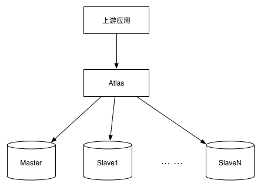

# 1. DBProxy安装
## 1.1 安装依赖项
<h1 id="1.1"></h1>

>### CentOS

```
yum install -y Percona-Server-devel-55.x86_64 Percona-Server-client-55.x86_64 Percona-Server-shared-55 jemalloc jemalloc-devel libevent openssl lua lua-devel glib2 glib2-devel bison flex libtool.x86_64
```

>### Ubuntu & Debian

```
apt-get install libmysqlclient-dev libgcrypt11-dev  pkg-config lua5.1-0 liblua5.1-0-dev libtool flex bison openssl  libssl-dev libjemalloc1 libjemalloc-dev  libevent-dev
```

**注意**

1. 操作系统版本：CentOS6.5 Ubuntu14.04 Debian8.2
2. 目前确认有效的glib2版本是2.42.0-1.el6，CentOS、Ubuntu和Debian默认源中的版本都不是2.42.0-1.el6，会导致make报错。

## 1.2 源码安装

- 源码从代码仓库下载到本地  
 
```
git clone git@github.com:Meituan-Dianping/DBProxy.git
```

- 编译源码并安装（添加新文件和修改版本的时候需要运行autogen.sh，注意docker centos:6.6 image下运行autogen.sh会失败）


```
sh autogen.sh
sh bootstrap.sh
make && make install
```

**注意**

目前DBProxy默认安装路径为：/usr/local/mysql-proxy。修改DBProxy默认安装路径，需要修改bootstrap.sh文件。例如将默认安装路径修改为： /usr/dbproxy，则需修改bootstrap.sh中--prefix后的参数，修改如下：

```
#!/bin/sh
base=$(cd "$(dirname "$0")"; pwd)
cd $base
./configure --prefix=/usr/dbproxy CFLAGS="-g -O0"  ##仅仅修改该行
```
 

# 2. 部署
## 2.1 部署结构介绍  
   
DBProxy 可以配置一主多从结构，即必须配置一个主库，0个或多个从库，主库可进行读写操作，从库只可进行读操作。上游组件/应用的流量可以通过DBProxy中设置的规则，将流量路由到合适的数据库中。DBProxy部署示意图如下所示：



## 2.2 配置文件的配置

成功安装DBProxy之后，需要在安装目录下创建配置文件所在的文件夹，例如取名conf，默认安装路径：

```
/usr/local/mysql-proxy
```

拷贝配置文件及其目录： 

```
mkdir /usr/local/mysql-proxy/conf   # 创建配置文件所在文件夹
cp script/source.cnf.samples /usr/local/mysql-proxy/conf/source.cnf #拷贝示例配置文件
```

下面列出了配置文件的一个子集，详细配置信息请参考[用户手册](USER_GUIDE.md)。以部署一主一从为例，主库：1.1.1.1:3306 从库：1.1.1.2:3306；DBProxy的admin和后端MySQL的用户名和密码均为guest，uqmOY9A=是guest加密之后的结果。 

```
[mysql-proxy]
#管理接口的用户名
admin-username=guest
#管理接口的密码
admin-password=guest

#用户名与其对应的加密过的MySQL密码，密码需要进行加密！
pwds=guest:uqmOY9A=

#DBProxy监听的管理接口IP和端口
admin-address=0.0.0.0:3308
#DBProxy监听的工作接口IP和端口
proxy-address=0.0.0.0:3307

#DBProxy后端连接的MySQL主库的IP和端口，可设置多项，用逗号分隔 如果不配置则默认127.0.0.1:3306
proxy-backend-addresses=1.1.1.1:3306
#DBProxy后端连接的MySQL从库的IP和端口，@后面的数字代表权重，用来作负载均衡，若省略则默认为1，可设置多项，用逗号分隔
proxy-read-only-backend-addresses=1.1.1.2:3306

#工作线程数，对DBProxy的性能有很大影响，可根据情况适当设置，默认为1
event-threads=8
#实例名称，用于同一台机器上多个DBProxy实例间的区分
instance=source
##日志存放的路径
log-path=/opt/tmp/dbproxy_log/
``` 

**特别注意**

配置文件中配置的“pwds=guest:uqmOY9A=”项中的密码是加密后的密码，加密方法：

```
./dbproxy/script/encrypt [原始密码]

```

## 2.3 启动DBProxy   
在安装目录下的bin/mysql-proxy进行启动，启动时需传入配置文件的路径。例如:默认安装的路径为：/usr/local/mysql-proxy，配置文件路径为：/usr/local/mysql-proxy/conf/source.cnf，且配置文件中配置了必须配置的参数，启动命令如下:

```
/usr/local/mysql-proxy/bin/mysql-proxy --defaults-file=/usr/local/mysql-proxy/conf/source.cnf
```

# 3 连接DBProxy 
## 3.1 DBProxy的端口介绍   
DBProxy 对外暴露两类端口：admin端口和proxy端口。admin端口是用来管理DBProxy的，管理员可以连接DBProxy的管理端口对DBProxy当前状态、参数进行查看和设置；proxy端口是用来与数据库进行交互的，应用端连接该端口，可与后台数据库进行交互。


## 3.2 连接admin端口  
- 查看配置文件中admin端口配置(账号密码端口号)   

```
#管理接口的用户名
admin-username=guest
#管理接口的密码
admin-password=guest
#DBProxy监听的管理接口IP和端口
admin-address=0.0.0.0:3308
```

- 连接(与连接mysql的命令一样)   

```
mysql -uguest -pguest -P3308 -h127.0.0.1
```

- 管理DBProxy

登录DBProxy的admin端口后，可以使用所提供的命令对DBProxy进行管理，查看DBProxy所提供的命令可使用：  

```
select * from help;
```

## 3.3 连接proxy端口   
- 查看配置文件中proxy端口配置(账号密码端口号)

``` 
#用户名与其对应的加密过的MySQL密码，密码需要进行加密！
pwds=guest:uqmOY9A=
#DBProxy监听的工作接口IP和端口
proxy-address=0.0.0.0:3307
```

- 连接(与连接mysql的命令一样)

```
mysql -uguest -pguest -P3307 -h127.0.0.1
```

- 发送sql语句 

连接proxy端口之后，便可以正常发送DBProxy兼容的sql语句了，例如:

```
use dbproxy_test;
select * from dbproxy_function_test;
```

# 4 源码修改  
DBProxy支持GPL开源协议，可以建立自己的本地分支进行功能的定制开发，也可以PullRequest帮助我们维护DBProxy。

DBProxy开发相关描述，详见：[DBProxy 开发手册](./PROGRAMMING_GUIDE.md)

# 5 RPM包的发布与安装   

## 5.1 打RPM包

```
sh dbproxy/script/build_dbproxy_rpm.sh -v [版本号] -r [release号]
```

## 5.2 RPM包安装

- 获取RPM包

```
wget [下载路径]
```

- 依赖安装

参考 [1.1 安装依赖项](#1.1) 

- 安装 DBProxy

```
rpm -ivh dbproxy-xxxxx.rpm

