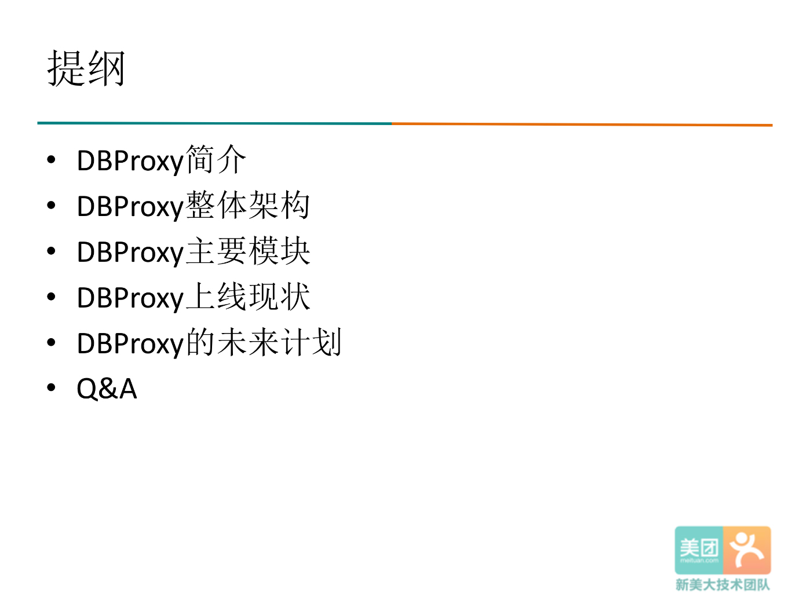
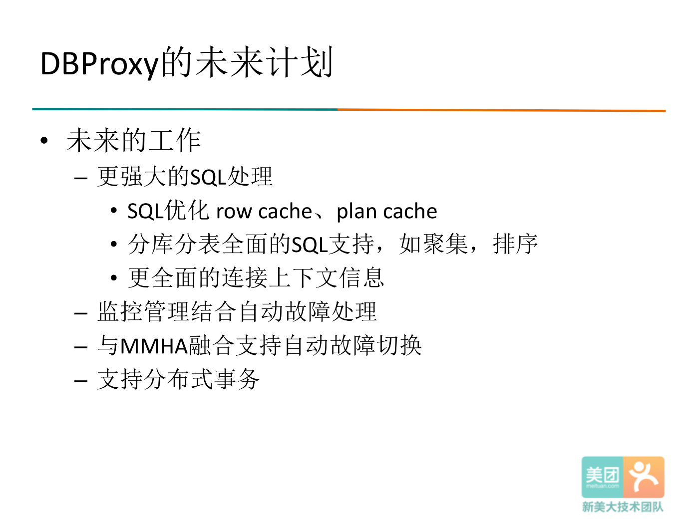

# 概述

这次分享的主要内容包括6个部分：

1. 简单介绍一下美团点评DBProxy；
1. 介绍一下美团点评DBProxy的整体架构；
1. 美团点评DBProxy的主要模块，介绍我们美团点评在上面的主要工作；
1. 上线的现状；
1. 后续的一些安排；
1. QA的部分；

# DBProxy的优点

首先介绍一下为什么要使用DBProxy:

* 使用DBProxy之后，应用程序只需要在连接串中设置DBProxy的地址，不需要关注整个数据库集群的结点；
* DBProxy内部实现负载均衡，读写分离；
* Slave上下线的操作由DBA在自动化运营系统上点一下鼠标就能够完成。

这样极大的减轻了DBA和应用开发人员的工作；而没有DBProxy的情况下，这些工作是由RD来实现的，引入DBProxy对于系统的可管理性和便利性都有非常大的帮助。

# DBProxy的软件模块

介绍DBProxy的软件模块。软件模块分三层：

* 第一层是一个访问控制，包括用户处理，IP过滤等等的功能；
* 中间层是一个SQL处理的过程，包括SQL解析，SQL重写，和SQL执行；
* 第三层就是一个主要和DBA连接相关的一个模块，像读写分离，负载均衡，连接池;
* 另外还有三个模块是贯穿整个三层的: 第一是连接的管理，负责管理收发数据的底层连接；第二是日志的管理，第三个是监控管理。

# DBProxy连接改进

首先介绍一下连接的管理：根据我们链路比较长的特点，着重添加了对于连接异常的检测和处理，包括：

* DBProxy上游和MGW交互的连接检测；
* DBProxy下游和MySQL连接的检测；
* DBProxy所在机器的连接检测。

# MTAltas SESSION级变量

SQL处理模块中增加了SESSION参数的功能: 客户端分配一个DB连接的时候，如果二者SESSION级参数不一样时，首先做一个校正，校正之后才会真正执行查询。

# DBProxy连接池改进

连接池的管理中做了这样的修改：将链表改成Hash表，其中Hash键是用户名，Hash值是以用户身份建立的连接的一个链表。如下图把连接按用户来分，client分别会分到各自user建立的db连接，二者互不影响，既保证了查询的正确性，又保证了较高的性能。

#DBProxy访问控制

下面讲一下访问控制模块，是在我们整个软件模型的第一层。

* 第一个是增加了一个SQL过滤的功能：
   * 该功能由黑名单的方式实现，黑名单的形式是如下边两个语句；
   * 黑名单可以根据执行的频率，执行的时间来自动的添加，其中频率时间，都是可以根据自己的需求动态修改的，另外我们也提供了一个手动添加黑名单的功能。
* 第二个个是根据后台db的thread running进行负载均衡，每当分配到一个后台的连接的时候，先检查后台的Thread running数，直到有一个thread running数在我阈值之内的时候才真正去分配。
* 第三个就是用户IP限制，我们限制了用户的host地址，相当于进行一个权限的控制。
* 最后一个就是从库流量配置，我可以指定某一个用户只能访问某几个从库，或者反过来说某几个从库只允许某几个用户访问，这样可能在一个更细的力度上对数据库的资源进行分配。

# DBProxy监控模块

DBProxy的监控体系实现了一个从无到有的过程，目前主要监控一些DBProxy内部运行相关的一些参数：

# DBProxy Sharding改进

对于sharding版本，做了如下的改进：

* 首先我们把分库变成分库分表，并且提供了5种分库分表的方式；
* 第二个是改进了Lemon基本上兼容MySQL语法；
* 第三个是有限支持单个库内部的JOIN，经过Lemon解析后，发现涉及的表都是在同一个库，那么表的JOIN是支持的；
* 同样的道理，单库的事务也是支持的。
* 最后一个就是增加错误处理：在一个库上面执行出错的时候，会相应有一些rollback的机制，来处理一些异常情况导致的执行失败。

Q：这方面能大概讲一下怎么去改进的？
A：首先是一个语法的支持，我们就是把中间不支持语法的支持，这样的话有些复杂的查询，我们可以通过这个语法来进行一些，比如说where条件的分析，可以知道分布分表的情况，然后就是表的替换。

# DBProxy上线现状

和大家分享一下上线的现状：从2015.5上线第一个版本后到现在已经有87%的服务组接入了DBProxy, DBProxy也已经经历了5个版本的迭代。

#DBProxy未来计划

最后讲一下未来的计划：

* 第一个就是更强大的SQL处理：
   * 增加一些SQL优化，Row cache的功能；
   * 分库分表全面的SQL支持，如聚集，排序；
   * 更全面的连接上下文信息；
* 第二：监控管理要结合自动故障处理，真正把监控的信息智能化；
* 第三：下一个是和我们美团点评自己的MHA融合，支持自动故障切换；
* 第四：支持分布式事务。

