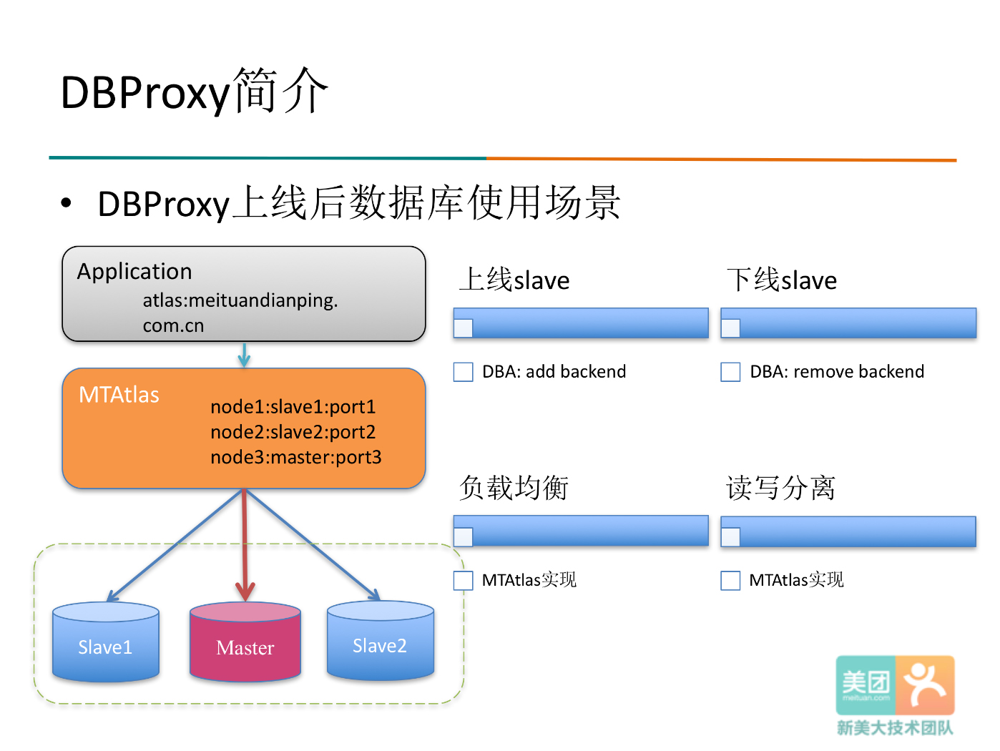
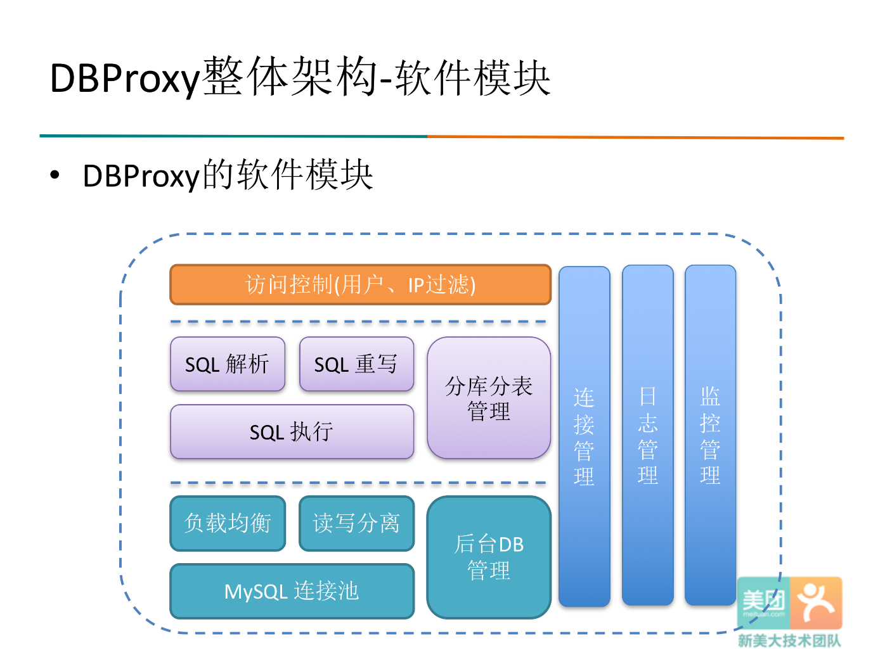
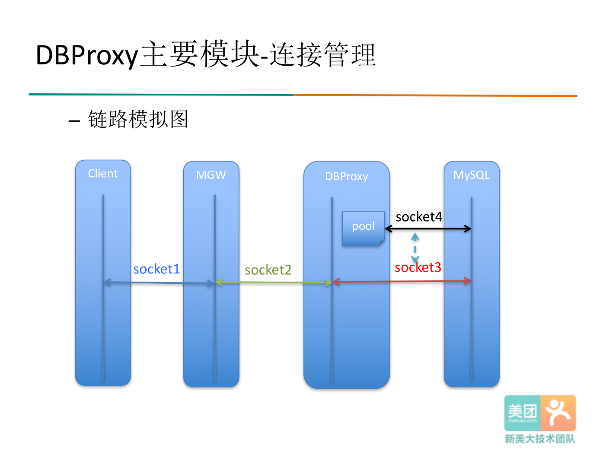
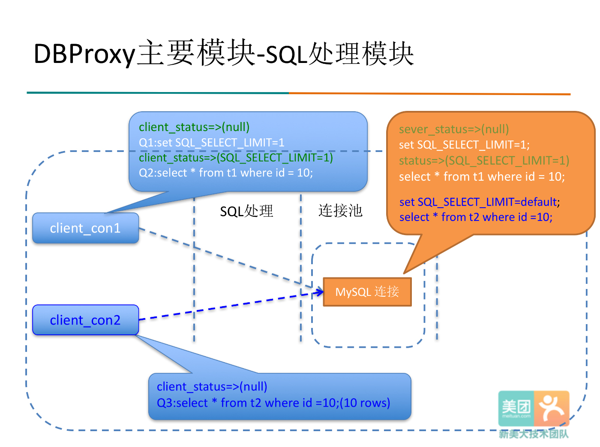
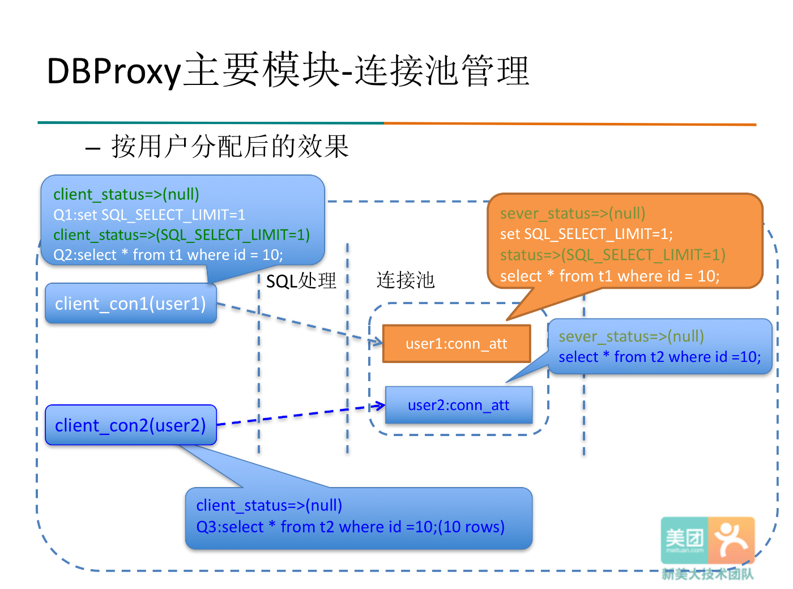
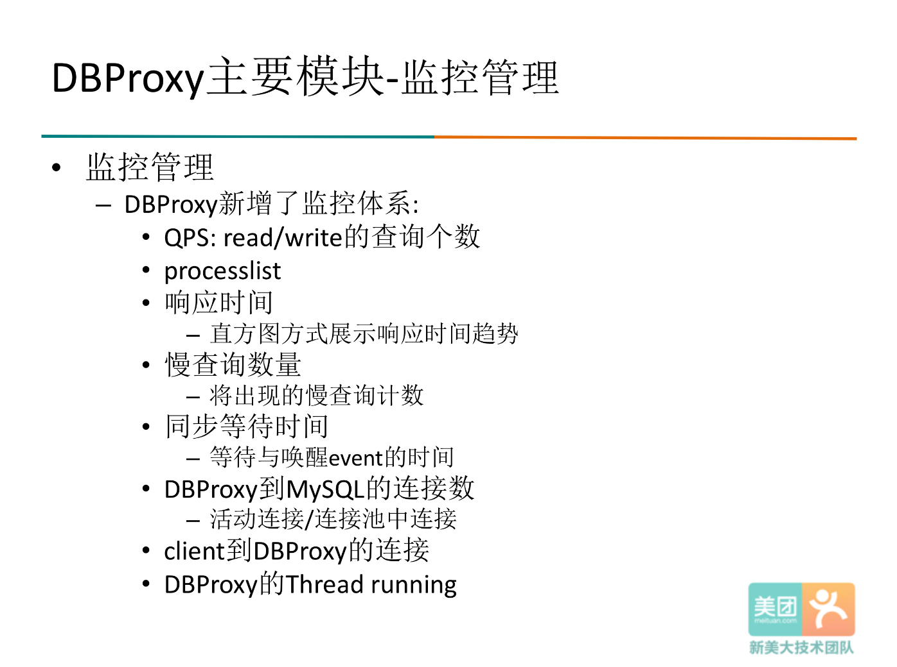
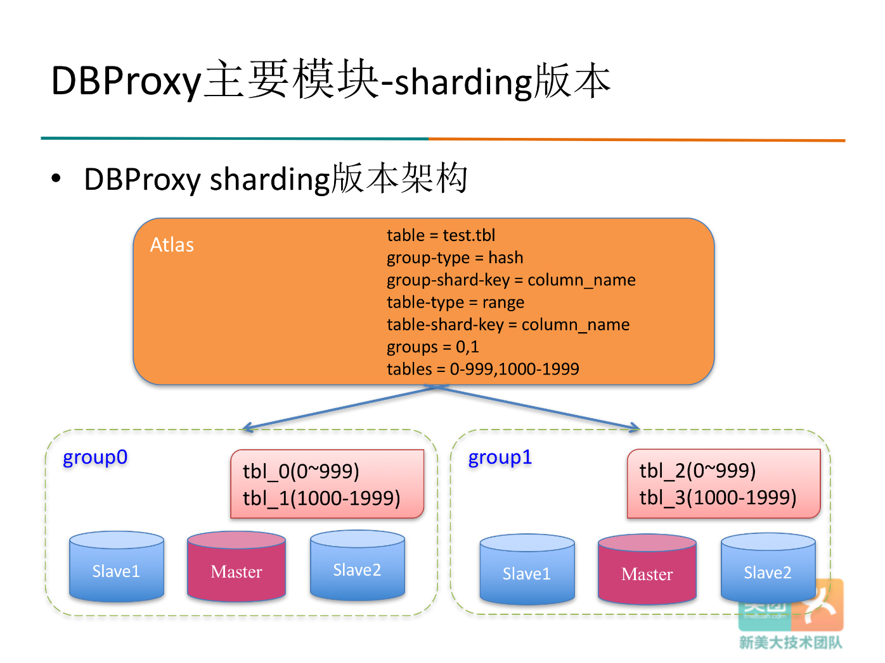
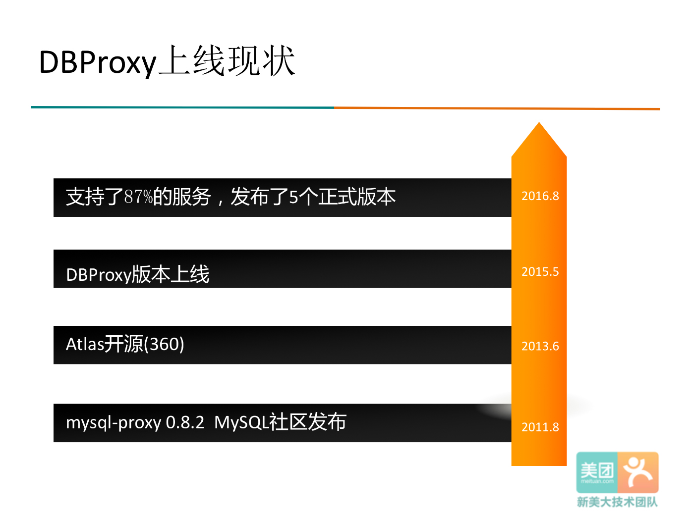

# 介绍   

随着数据量的不断增大，传统的直连数据库对数据进行访问的方式已经无法满足一般公司的需求。通过数据库中间件，可以对数据库进行水平扩展，由原来单台数据库扩展到多台数据库，数据库中间件通过路由规则将数据的访问请求路由到其中一台数据库上，从而大大降低了数据访问的瓶颈和单台数据库的压力。并且通过数据库中间件可以将DBA和研发进行解耦，提升DBA运维效率。

目前美团点评内部使用的中间件DBProxy是在奇虎360公司开源的Atlas上继续开发，逐渐满足公司内部需求。

美团点评致力于将DBProxy打造成一款高可靠、高可用的一款企业级数据库中间件，选择将已经**在公司内部使用的较为成熟（包括支付、外卖、团购、酒旅等）**、稳定的DBProxy进行开源，[github地址](https://github.com/Meituan-Dianping/DBProxy)。希望与业内同样有数据库中间件需求的团队，在DBProxy基础上一起打造一款企业级优良的数据库中间件产品。

# DBProxy的优点

1. 支持多语言MySQL客户端
1. 读写分离
1. 负载均衡
1. Slave故障感知与摘除（Master需要需要MHA等其他联动）
1. 后端连接池
1. 自定义SQL拦截与过滤
1. 流量分组与控制
1. 丰富的监控状态
1. 支持分表（分库版本正在内测中）
1. Client IP限制

使用DBProxy典型场景:

```
使用前：

1. Client端使用配置文件配置主从信息，需要业务端实现负载均衡、读写分离、分表；
2. 扩容或者主库切换时，需要DBA和业务紧密配合，DBA扩容或者切换之后，业务需要及时修改配置文件；
3. Slave故障时，需要DBA通知业务及时变更配置信息。
```

```
使用后：

1. 应用程序在连接串中设置DBProxy的地址，不需要关注整个数据库集群的拓扑结构；
2. DBProxy内部实现负载均衡，读写分离；
3. Slave上下线的操作由DBA通过Atlas Admin管理接口完成；
4. Slave故障时，DBProxy自动摘除。
```

这样极大的减轻了DBA和应用开发人员的工作，引入DBProxy对于系统的可管理性和便利性都有非常大的帮助。




# DBProxy软件模块

介绍DBProxy的软件模块。软件模块分三层：

1. 第一层是一个访问控制，包括用户处理，IP过滤等等的功能；
1. 中间层是一个SQL处理的过程，包括SQL解析，SQL重写，和SQL执行；
1. 第三层就是一个主要和DBA连接相关的一个模块，像读写分离，负载均衡，连接池;
1. 另外还有三个模块是贯穿整个三层的: 第一是连接的管理，负责管理收发数据的底层连接；第二是日志的管理，第三个是监控管理。



# DBProxy连接改进

根据我们链路比较长的特点，着重添加了对于连接异常的检测和处理，包括：

1. DBProxy上游和MGW交互的连接检测；
1. DBProxy下游和MySQL连接的检测；
1. DBProxy所在机器的连接检测。



# DBProxy SESSION级变量

SQL处理模块中增加了SESSION参数的功能: 客户端分配一个DB连接的时候，如果二者SESSION级参数不一样时，首先做一个校正，校正之后才会真正执行查询。



# DBProxy连接池改进

连接池的管理中做了这样的修改：将链表改成Hash表，其中Hash键是用户名，Hash值是以用户身份建立的连接的一个链表。如下图把连接按用户来分，client分别会分到各自user建立的db连接，二者互不影响，既保证了查询的正确性，又保证了较高的性能。



#DBProxy访问控制


1. 增加了一个SQL过滤的功能：
   * 该功能由黑名单的方式实现，黑名单的形式是如下边两个语句；
   * 黑名单可以根据执行的频率，执行的时间来自动的添加，其中频率时间，都是可以根据自己的需求动态修改的，另外我们也提供了一个手动添加黑名单的功能。
1. 根据后台db的thread running进行负载均衡，每当分配到一个后台的连接的时候，先检查后台的Thread running数，直到有一个thread running数在我阈值之内的时候才真正去分配。
1. 用户IP限制，限制了用户的host地址，相当于进行一个权限的控制。
1. 从库流量配置，可以指定某一个用户只能访问某几个从库，或者反过来说某几个从库只允许某几个用户访问，这样可能在一个更细的力度上对数据库的资源进行分配。



# DBProxy监控模块

DBProxy的监控体系实现了一个从无到有的过程，目前主要监控一些DBProxy内部运行相关的一些参数：


# DBProxy Sharding改进

对于sharding版本，做了如下的改进：

1. 把分库变成分库分表，并且提供了5种分库分表的方式；
1. 改进了Lemon基本上兼容MySQL语法；
1. 有限支持单个库内部的JOIN，经过Lemon解析后，发现涉及的表都是在同一个库，那么表的JOIN是支持的；
1. 支持单库的事务；
1. 增加错误处理：在一个库上面执行出错的时候，会相应有一些rollback的机制，来处理一些异常情况导致的执行失败。



Q：这方面能大概讲一下怎么去改进的？
A：首先是一个语法的支持，我们就是把中间不支持语法的支持，这样的话有些复杂的查询，我们可以通过这个语法来进行一些，比如说where条件的分析，可以知道分布分表的情况，然后就是表的替换。

# DBProxy上线现状

从2015.5上线第一个版本后到现在已经有87%的服务组接入了DBProxy, DBProxy也已经经历了5个版本的迭代。




# DBProxy对Atlas的改进  

DBProxy在开源Atlas的基础上，我们做了以下努力和工作（截止目前：27个功能点的新增；17个bug的修复）

- 主要增加的新功能
    - 从库流量配置  
      指定查询发送到某个从库
	- 参数动态设置(完善show proxy status/variables)  
	  参数动态的设置: 以及支持save config，动态增加、删除分表
	- 响应时间percentile统计  
	  统计最近时间段DBProxy的响应时间
	- kill session  
	  支持DBProxy的admin接口kill session操作
	- backend平滑上下线  
	支持平滑的backend上下线
	- DBProxy非root用户启动  
	使用非root用户启动
	- admin账号的安全限制  
	admin账号密码的动态修改及host限制
	- 增加异步刷日志的功能  
	增加日志线程，异步刷日志，提高响应时间
    - 支持DBProxy平滑重启功能  
    - 支持SQL过滤的黑名单功能
    - 支持对于MySQL后台的thread running限制功能  
    该功能通过在DBProxy内限制每个后台MySQL的并发查询来控制对应MySQL的thread running数。  
    当发向某个MySQL后台的的并发查询超过某个阈值时，会进行超时等待，直到有可用的连接，其中阈值与超时等待的时间都已经参数化，可以动态配置。
    - set backend offline不再显示节点状态
    - 支持set transaction isolation level
    - 支持use db
    - 支持set option语句
    - 支持set session级系统变量
    - 支持建立连接时指定连接属性。
    - 改进连接池的连接管理，增加超时释放机制。当连接池中的空闲连接闲置超过一定时间后，自动释放连接。由参数db-connection-idle-timeout控制。
    - 增加客户端连接的keepalive机制，避免网络异常后释放已断开的连接。
    - 完善管理日志，增加了管理命令日志、错误语句日志以及详细的错误日志。
    - 完善SQL日志信息，包含了详细的连接信息，并包含了DBProxy内部执行的隐式SQL语句。隐式SQL语句主要是连接重用时切换database、字符集的语句。
    - 增加SQL日志rotate机制，可设置日志文件最大大小和日志文件最大个数，自动清理早期的SQL日志。分别由参数sql-log-file-size和sql-log-file-num控制。
    - 增加后台MySQL版本号设置，主要影响MySQL连接协议中的server版本，客户端驱动可能依赖于server版本处理机制有所不同。由参数mysql-version控制。
    - 性能改进，将SQL词法分析从串行方式改进为并发方式；其次，在每次执行SQL前如果database相同时，不再需要执行COM_INIT_DB命令。根据测试结果，在特定环境下sysbench的QPS从7万提升至22万。
	- 增加监控统计信息，包括连接状态、QPS、响应时间、网络等统计
	- sql log动态配置
	- 改进autocommit为false时频繁连接主库的问题

新功能和Bug修复描述，详见[release notes](https://github.com/Meituan-Dianping/DBProxy/blob/master/doc/RELEASE_NOTES.md)。


# DBProxy计划


1. 更强大的SQL处理：
   * 增加一些SQL优化，Row cache的功能；
   * 分库分表全面的SQL支持，如聚集，排序；
   * 更全面的连接上下文信息；
1. 监控管理要结合自动故障处理，真正把监控的信息智能化；
1. 和我们美团点评自己的MHA融合，支持自动故障切换；
1. 支持分布式事务。

希望和各位同行共同打造一款企业级高可用、高可靠的数据库中间件产品，希望大家能够积极参与。

欢迎大家将需求或发现的Bug在github上提交[issue](https://github.com/Meituan-Dianping/DBProxy/issues)，帮助DBProxy的壮大；也欢迎大家在DBProxy用户交流群（QQ: 367199679）相互交流，共同学习。


[DBProxy的github地址](https://github.com/Meituan-Dianping/DBProxy)

# DBProxy手册

1. [DBProxy快速入门教程](./QUICK_START.md)
1. [DBProxy用户使用手册](./USER_GUIDE.md)
1. [DBProxy开发手册](./PROGRAMMING_GUIDE.md)
1. [DBProxy架构和实践](./THEORY_PRACTICES.md)
1. [DBProxy release notes](./RELEASE_NOTES.md)
1. [DBProxy 测试手册](./TEST_GUIDE.md)
1. [FAQ](./FAQ.md)
1. [DBProxy开发规范](./DEVELOPMENT_NORM.md)

