[1 总体信息](#1)   
&nbsp;&nbsp;&nbsp;&nbsp;&nbsp;&nbsp;&nbsp;&nbsp;[1.1 关于本手册](#1.1)   
&nbsp;&nbsp;&nbsp;&nbsp;&nbsp;&nbsp;&nbsp;&nbsp;[1.2  DBProxy概述](#1.2)    
&nbsp;&nbsp;&nbsp;&nbsp;&nbsp;&nbsp;&nbsp;&nbsp;&nbsp;&nbsp;&nbsp;&nbsp;[1.2.1 DBProxy简介](#1.2.1)      
&nbsp;&nbsp;&nbsp;&nbsp;&nbsp;&nbsp;&nbsp;&nbsp;&nbsp;&nbsp;&nbsp;&nbsp;[1.2.2 DBProxy主要特性](#1.2.2)    
&nbsp;&nbsp;&nbsp;&nbsp;&nbsp;&nbsp;&nbsp;&nbsp;&nbsp;&nbsp;&nbsp;&nbsp;[1.2.3 DBProxy发展历程](#1.2.3)    
&nbsp;&nbsp;&nbsp;&nbsp;&nbsp;&nbsp;&nbsp;&nbsp;[1.3 文档中的符号含义说明](#1.3)      
&nbsp;&nbsp;&nbsp;&nbsp;&nbsp;&nbsp;&nbsp;&nbsp;[1.4 约定](#1.4)    
&nbsp;&nbsp;&nbsp;&nbsp;&nbsp;&nbsp;&nbsp;&nbsp;[1.5 各发布版本信息](#1.5)    
[2 安装与部署](#2)    
[3 使用教程](#3)    
&nbsp;&nbsp;&nbsp;&nbsp;&nbsp;&nbsp;&nbsp;&nbsp;[3.1 启动](#3.1)    
&nbsp;&nbsp;&nbsp;&nbsp;&nbsp;&nbsp;&nbsp;&nbsp;&nbsp;&nbsp;&nbsp;&nbsp;[3.1.1 脚本启动](#3.1.1)    
&nbsp;&nbsp;&nbsp;&nbsp;&nbsp;&nbsp;&nbsp;&nbsp;&nbsp;&nbsp;&nbsp;&nbsp;[3.1.2 非脚本启动](#3.1.2)   
&nbsp;&nbsp;&nbsp;&nbsp;&nbsp;&nbsp;&nbsp;&nbsp;[3.2 DBProxy兼容的SQL语法](#3.2)   
&nbsp;&nbsp;&nbsp;&nbsp;&nbsp;&nbsp;&nbsp;&nbsp;&nbsp;&nbsp;&nbsp;&nbsp;[3.2.1 SQL语句支持限制](#3.2.1)    
&nbsp;&nbsp;&nbsp;&nbsp;&nbsp;&nbsp;&nbsp;&nbsp;&nbsp;&nbsp;&nbsp;&nbsp;&nbsp;&nbsp;&nbsp;&nbsp;[3.2.1.1 不支持的语句](#3.2.1.1)    
&nbsp;&nbsp;&nbsp;&nbsp;&nbsp;&nbsp;&nbsp;&nbsp;&nbsp;&nbsp;&nbsp;&nbsp;&nbsp;&nbsp;&nbsp;&nbsp;[3.2.1.2 for update限制](#3.2.1.2)        
&nbsp;&nbsp;&nbsp;&nbsp;&nbsp;&nbsp;&nbsp;&nbsp;&nbsp;&nbsp;&nbsp;&nbsp;&nbsp;&nbsp;&nbsp;&nbsp;[3.2.1.3 update/delete操作限制](#3.2.1.3)    
&nbsp;&nbsp;&nbsp;&nbsp;&nbsp;&nbsp;&nbsp;&nbsp;&nbsp;&nbsp;&nbsp;&nbsp;&nbsp;&nbsp;&nbsp;&nbsp;[3.2.1.4 load data限制](#3.2.1.4)   
&nbsp;&nbsp;&nbsp;&nbsp;&nbsp;&nbsp;&nbsp;&nbsp;&nbsp;&nbsp;&nbsp;&nbsp;&nbsp;&nbsp;&nbsp;&nbsp;[3.2.1.5 set option限制](#3.2.1.5)     
&nbsp;&nbsp;&nbsp;&nbsp;&nbsp;&nbsp;&nbsp;&nbsp;&nbsp;&nbsp;&nbsp;&nbsp;[3.2.2 后台DB连接池带来的限制](#3.2.2)     
&nbsp;&nbsp;&nbsp;&nbsp;&nbsp;&nbsp;&nbsp;&nbsp;&nbsp;&nbsp;&nbsp;&nbsp;&nbsp;&nbsp;&nbsp;&nbsp;[3.2.2.1 session级系统变量限制](#3.2.2.1)    
&nbsp;&nbsp;&nbsp;&nbsp;&nbsp;&nbsp;&nbsp;&nbsp;&nbsp;&nbsp;&nbsp;&nbsp;&nbsp;&nbsp;&nbsp;&nbsp;[3.2.2.2 获取上下文语句的限制](#3.2.2.2)   
&nbsp;&nbsp;&nbsp;&nbsp;&nbsp;&nbsp;&nbsp;&nbsp;&nbsp;&nbsp;&nbsp;&nbsp;&nbsp;&nbsp;&nbsp;&nbsp;[3.2.2.3 temporary表限制](#3.2.2.3)   
&nbsp;&nbsp;&nbsp;&nbsp;&nbsp;&nbsp;&nbsp;&nbsp;&nbsp;&nbsp;&nbsp;&nbsp;&nbsp;&nbsp;&nbsp;&nbsp;[3.2.2.4 cur/prepare功能限制](#3.2.2.4)    
&nbsp;&nbsp;&nbsp;&nbsp;&nbsp;&nbsp;&nbsp;&nbsp;&nbsp;&nbsp;&nbsp;&nbsp;&nbsp;&nbsp;&nbsp;&nbsp;[3.2.2.5 客户端驱动有关的限制](#3.2.2.5)    
&nbsp;&nbsp;&nbsp;&nbsp;&nbsp;&nbsp;&nbsp;&nbsp;&nbsp;&nbsp;&nbsp;&nbsp;&nbsp;&nbsp;&nbsp;&nbsp;[3.2.2.6 连接属性设置](#3.2.2.6)           
&nbsp;&nbsp;&nbsp;&nbsp;&nbsp;&nbsp;&nbsp;&nbsp;&nbsp;&nbsp;&nbsp;&nbsp;[3.2.3 DBProxy配置方面的限制](#3.2.3)      
&nbsp;&nbsp;&nbsp;&nbsp;&nbsp;&nbsp;&nbsp;&nbsp;&nbsp;&nbsp;&nbsp;&nbsp;[3.2.4 分表的限制](#3.2.4)        
&nbsp;&nbsp;&nbsp;&nbsp;&nbsp;&nbsp;&nbsp;&nbsp;[3.3 DBProxy管理](#3.3)    
&nbsp;&nbsp;&nbsp;&nbsp;&nbsp;&nbsp;&nbsp;&nbsp;&nbsp;&nbsp;&nbsp;&nbsp;[3.3.1 基本操作管理](#3.3.1)     
&nbsp;&nbsp;&nbsp;&nbsp;&nbsp;&nbsp;&nbsp;&nbsp;&nbsp;&nbsp;&nbsp;&nbsp;&nbsp;&nbsp;&nbsp;&nbsp;[3.3.1.1 启动用户设置](#3.3.1.1)     
&nbsp;&nbsp;&nbsp;&nbsp;&nbsp;&nbsp;&nbsp;&nbsp;&nbsp;&nbsp;&nbsp;&nbsp;&nbsp;&nbsp;&nbsp;&nbsp;[3.3.1.2 平滑关闭](#3.3.1.2)     
&nbsp;&nbsp;&nbsp;&nbsp;&nbsp;&nbsp;&nbsp;&nbsp;&nbsp;&nbsp;&nbsp;&nbsp;&nbsp;&nbsp;&nbsp;&nbsp;[3.3.1.3 服务端口的设置](#3.3.1.3)     
&nbsp;&nbsp;&nbsp;&nbsp;&nbsp;&nbsp;&nbsp;&nbsp;&nbsp;&nbsp;&nbsp;&nbsp;&nbsp;&nbsp;&nbsp;&nbsp;[3.3.1.4 版本查看](#3.3.1.4)     
&nbsp;&nbsp;&nbsp;&nbsp;&nbsp;&nbsp;&nbsp;&nbsp;&nbsp;&nbsp;&nbsp;&nbsp;&nbsp;&nbsp;&nbsp;&nbsp;[3.3.1.5 DBProxy运行方式设置](#3.3.1.5)     
&nbsp;&nbsp;&nbsp;&nbsp;&nbsp;&nbsp;&nbsp;&nbsp;&nbsp;&nbsp;&nbsp;&nbsp;&nbsp;&nbsp;&nbsp;&nbsp;[3.3.1.6 DBProxy监控进程配置](#3.3.1.6)     
&nbsp;&nbsp;&nbsp;&nbsp;&nbsp;&nbsp;&nbsp;&nbsp;&nbsp;&nbsp;&nbsp;&nbsp;&nbsp;&nbsp;&nbsp;&nbsp;[3.3.1.7 工作线程数量设置](#3.3.1.7)     
&nbsp;&nbsp;&nbsp;&nbsp;&nbsp;&nbsp;&nbsp;&nbsp;&nbsp;&nbsp;&nbsp;&nbsp;&nbsp;&nbsp;&nbsp;&nbsp;[3.3.1.8 实例名称设置](#3.3.1.8)     
&nbsp;&nbsp;&nbsp;&nbsp;&nbsp;&nbsp;&nbsp;&nbsp;&nbsp;&nbsp;&nbsp;&nbsp;&nbsp;&nbsp;&nbsp;&nbsp;[3.3.1.9 查看启动命令行支持的命令](#3.3.1.9)     
&nbsp;&nbsp;&nbsp;&nbsp;&nbsp;&nbsp;&nbsp;&nbsp;&nbsp;&nbsp;&nbsp;&nbsp;&nbsp;&nbsp;&nbsp;&nbsp;[3.3.1.10 查看admin端口支持的命令](#3.3.1.10)     
&nbsp;&nbsp;&nbsp;&nbsp;&nbsp;&nbsp;&nbsp;&nbsp;&nbsp;&nbsp;&nbsp;&nbsp;&nbsp;&nbsp;&nbsp;&nbsp;[3.3.1.11 参数保存](#3.3.1.11)     
&nbsp;&nbsp;&nbsp;&nbsp;&nbsp;&nbsp;&nbsp;&nbsp;&nbsp;&nbsp;&nbsp;&nbsp;[3.3.2 用户管理](#3.3.2)        
&nbsp;&nbsp;&nbsp;&nbsp;&nbsp;&nbsp;&nbsp;&nbsp;&nbsp;&nbsp;&nbsp;&nbsp;&nbsp;&nbsp;&nbsp;&nbsp;[3.3.2.1 admin 用户](#3.3.2.1)     
&nbsp;&nbsp;&nbsp;&nbsp;&nbsp;&nbsp;&nbsp;&nbsp;&nbsp;&nbsp;&nbsp;&nbsp;&nbsp;&nbsp;&nbsp;&nbsp;[3.3.2.2 proxy用户](#3.3.2.2)     
&nbsp;&nbsp;&nbsp;&nbsp;&nbsp;&nbsp;&nbsp;&nbsp;&nbsp;&nbsp;&nbsp;&nbsp;&nbsp;&nbsp;&nbsp;&nbsp;[3.3.2.3 monitor用户](#3.3.2.3)     
&nbsp;&nbsp;&nbsp;&nbsp;&nbsp;&nbsp;&nbsp;&nbsp;&nbsp;&nbsp;&nbsp;&nbsp;[3.3.3 连接管理](#3.3.3)          
&nbsp;&nbsp;&nbsp;&nbsp;&nbsp;&nbsp;&nbsp;&nbsp;&nbsp;&nbsp;&nbsp;&nbsp;&nbsp;&nbsp;&nbsp;&nbsp;[3.3.3.1 查看当前连接](#3.3.3.1)     
&nbsp;&nbsp;&nbsp;&nbsp;&nbsp;&nbsp;&nbsp;&nbsp;&nbsp;&nbsp;&nbsp;&nbsp;&nbsp;&nbsp;&nbsp;&nbsp;[3.3.3.2 结束连接](#3.3.3.2)     
&nbsp;&nbsp;&nbsp;&nbsp;&nbsp;&nbsp;&nbsp;&nbsp;&nbsp;&nbsp;&nbsp;&nbsp;&nbsp;&nbsp;&nbsp;&nbsp;[3.3.3.3 连接相关的参数](#3.3.3.3)     
&nbsp;&nbsp;&nbsp;&nbsp;&nbsp;&nbsp;&nbsp;&nbsp;&nbsp;&nbsp;&nbsp;&nbsp;[3.3.4 分表管理](#3.3.4)           
&nbsp;&nbsp;&nbsp;&nbsp;&nbsp;&nbsp;&nbsp;&nbsp;&nbsp;&nbsp;&nbsp;&nbsp;&nbsp;&nbsp;&nbsp;&nbsp;[3.3.4.1 分表的配置](#3.3.4.1)     
&nbsp;&nbsp;&nbsp;&nbsp;&nbsp;&nbsp;&nbsp;&nbsp;&nbsp;&nbsp;&nbsp;&nbsp;&nbsp;&nbsp;&nbsp;&nbsp;[3.3.4.2 分表限制](#3.3.4.2)     
&nbsp;&nbsp;&nbsp;&nbsp;&nbsp;&nbsp;&nbsp;&nbsp;&nbsp;&nbsp;&nbsp;&nbsp;[3.3.5 backend管理](#3.3.5)               
&nbsp;&nbsp;&nbsp;&nbsp;&nbsp;&nbsp;&nbsp;&nbsp;&nbsp;&nbsp;&nbsp;&nbsp;&nbsp;&nbsp;&nbsp;&nbsp;[3.3.5.1 backend的配置](#3.3.5.1)         
&nbsp;&nbsp;&nbsp;&nbsp;&nbsp;&nbsp;&nbsp;&nbsp;&nbsp;&nbsp;&nbsp;&nbsp;&nbsp;&nbsp;&nbsp;&nbsp;[3.3.5.2 backend过载保护](#3.3.5.2)     
&nbsp;&nbsp;&nbsp;&nbsp;&nbsp;&nbsp;&nbsp;&nbsp;&nbsp;&nbsp;&nbsp;&nbsp;&nbsp;&nbsp;&nbsp;&nbsp;[3.3.5.3 backend版本配置](#3.3.5.3)     
&nbsp;&nbsp;&nbsp;&nbsp;&nbsp;&nbsp;&nbsp;&nbsp;&nbsp;&nbsp;&nbsp;&nbsp;[3.3.6 日志管理](#3.3.6)    
&nbsp;&nbsp;&nbsp;&nbsp;&nbsp;&nbsp;&nbsp;&nbsp;&nbsp;&nbsp;&nbsp;&nbsp;[3.3.7 流量管理](#3.3.7)    
&nbsp;&nbsp;&nbsp;&nbsp;&nbsp;&nbsp;&nbsp;&nbsp;&nbsp;&nbsp;&nbsp;&nbsp;&nbsp;&nbsp;&nbsp;&nbsp;[3.3.7.1 SQL 过滤](#3.3.7.1)    
&nbsp;&nbsp;&nbsp;&nbsp;&nbsp;&nbsp;&nbsp;&nbsp;&nbsp;&nbsp;&nbsp;&nbsp;&nbsp;&nbsp;&nbsp;&nbsp;[3.3.7.2 从库流量配置](#3.3.7.2)    
&nbsp;&nbsp;&nbsp;&nbsp;&nbsp;&nbsp;&nbsp;&nbsp;&nbsp;&nbsp;&nbsp;&nbsp;&nbsp;&nbsp;&nbsp;&nbsp;[3.3.7.3 主库流量配置](#3.3.7.3)    
&nbsp;&nbsp;&nbsp;&nbsp;&nbsp;&nbsp;&nbsp;&nbsp;&nbsp;&nbsp;&nbsp;&nbsp;[3.3.8 统计信息管理](#3.3.8)         
&nbsp;&nbsp;&nbsp;&nbsp;&nbsp;&nbsp;&nbsp;&nbsp;&nbsp;&nbsp;&nbsp;&nbsp;&nbsp;&nbsp;&nbsp;&nbsp;[3.3.8.1 响应时间统计](#3.3.8.1)       
&nbsp;&nbsp;&nbsp;&nbsp;&nbsp;&nbsp;&nbsp;&nbsp;&nbsp;&nbsp;&nbsp;&nbsp;&nbsp;&nbsp;&nbsp;&nbsp;[3.3.8.2 percentile](#3.3.8.2)         
&nbsp;&nbsp;&nbsp;&nbsp;&nbsp;&nbsp;&nbsp;&nbsp;&nbsp;&nbsp;&nbsp;&nbsp;[3.3.9 监控管理](#3.3.9)         
&nbsp;&nbsp;&nbsp;&nbsp;&nbsp;&nbsp;&nbsp;&nbsp;&nbsp;&nbsp;&nbsp;&nbsp;&nbsp;&nbsp;&nbsp;&nbsp;[3.3.9.1 参数查看](#3.3.9.1)       
&nbsp;&nbsp;&nbsp;&nbsp;&nbsp;&nbsp;&nbsp;&nbsp;&nbsp;&nbsp;&nbsp;&nbsp;&nbsp;&nbsp;&nbsp;&nbsp;[3.3.9.2 状态查看](#3.3.9.2)    
&nbsp;&nbsp;&nbsp;&nbsp;&nbsp;&nbsp;&nbsp;&nbsp;&nbsp;&nbsp;&nbsp;&nbsp;&nbsp;&nbsp;&nbsp;&nbsp;[3.3.9.3 最近查询语句的查看](#3.3.9.3)       
&nbsp;&nbsp;&nbsp;&nbsp;&nbsp;&nbsp;&nbsp;&nbsp;&nbsp;&nbsp;&nbsp;&nbsp;&nbsp;&nbsp;&nbsp;&nbsp;[3.3.9.4 查询相应时间查看](#3.3.9.4)    
&nbsp;&nbsp;&nbsp;&nbsp;&nbsp;&nbsp;&nbsp;&nbsp;&nbsp;&nbsp;&nbsp;&nbsp;&nbsp;&nbsp;&nbsp;&nbsp;[3.3.9.5 事件等待状态查看](#3.3.9.5)    

# 1 总体信息
<h1 id="1"></h1>    

## 1.1 关于本手册
<h1 id="1.1"></h1>   

本参考手册仅针对**美团点评**内部目前使用的 DBProxy v0.2.0 版本功能和使用方法进行介绍，意在使用户更快速的掌握DBProxy v0.2.0 版本提供的各种功能，以及更便捷的针对线上使用DBProxy v0.2.0 出现的故障进行排错。    

## 1.2  DBProxy概述
<h1 id="1.2"></h1>    

### 1.2.1 DBProxy简介
<h1 id="1.2.1"></h1>    
  
DBProxy是一个位于前端应用与后端MySQL数据库之间的中间件，它使得应用程序员无需再关心读写分离、分表等与MySQL相关的细节，可以专注于编写业务逻辑，同时使得DBA的运维工作对前端应用透明，上下线DB前端应用无感知。     

### 1.2.2 DBProxy主要特性
<h1 id="1.2.2"></h1>    

- 读写分离     
- 负载均衡    
- 支持分表     
- IP过滤    
- sql语句黑名单    
- DBA平滑下线DB   
- 从库流量配置    
- 动态加载配置项    

### 1.2.3 DBProxy发展历程 
<h1 id="1.2.3"></h1>   

DBProxy 的前身是由 Qihoo 360公司Web平台部基础架构团队开发维护的一个基于MySQL协议的数据中间层项目Atlas。Atlas是在MySQL官方推出的MySQL-Proxy 0.8.2版本的基础上，修改了大量bug，添加了很多功能特性。Atlas项目在360公司内部得到了广泛应用，很多MySQL业务已经接入了Atlas平台，每天承载的读写请求数达几十亿条。
    
美团点评 自2015年在开源Atlas版本基础上进行了开发，满足了公司内部各项业务的场景需求，最终演化成了美团点评内部使用的中间件DBProxy。

## 1.3 文档中的符号含义说明    
<h1 id="1.3"></h1>

<table  align="left" style="width : 100%;">
	<tr>
		<th>序号</th>
		<th>符号</th>
		<th>含义</th>
	</tr>
	<tr align="left">
		<td>1</td>
		<td>[xx]</td>
		<td>xx内容可选，即可以不出现、出现一次或多次</td>
	</tr>
	<tr align="left">
		<td>2</td>
		<td>$value</td>
		<td>value表示命令中，需要用户输入的变量参数</td>
	</tr>
	<tr align="left">
		<td>3</td>
		<td>A|B|C</td>
		<td>代表可选择A/B/C其中之一</td>
	</tr>
</table>      

## 1.4 约定
<h1 id="1.4"></h1>   

对DBProxy的配置文件的修改，需要**重启**配置才会**生效**。    
        
## 1.5 各发布版本信息
<h1 id="1.5"></h1>    

详见[release notes](./RELEASE_NOTES.md)
         
# 2 安装与部署
<h1 id="2"></h1>           

- 安装与部署

参考[快速入门手册](./QUICK_START.md)中的对应章节

- 配置文件详细说明  
配置文件基本配置如下(*表示启动时必须配置的选项)     

```
#*标志代表必须配置
[mysql-proxy]
#*管理接口的用户名
admin-username=monitor
#*管理接口的密码
admin-password=xxxx
#*DBProxy监听的管理接口IP和端口
admin-address=0.0.0.0:3308
  
#用户名与其对应的加密过的MySQL密码，密码需要进行加密！
pwds=root:xxxx
#*DBProxy监听的工作接口IP和端口
proxy-address=0.0.0.0:3307
  
#*DBProxy后端连接的MySQL主库的IP和端口，可设置多项，用逗号分隔 如果不配置则默认127.0.0.1:3306
proxy-backend-addresses=1.1.1.1:3306
#DBProxy后端连接的MySQL从库的IP和端口，@后面的数字代表权重，用来作负载均衡，若省略则默认为1，可设置多项，用逗号分隔
proxy-read-only-backend-addresses=2.2.2.2:3306$tag_mt@10,3.3.3.3:3306
  
#*实例名称，用于同一台机器上多个DBProxy实例间的区分
instance=source
  
##*日志存放的路径
log-path=/opt/tmp/dbproxy_log/
#SQL日志的开关，可设置为OFF、ON、REALTIME，OFF代表不记录SQL日志，ON代表记录SQL日志，REALTIME代表记录SQL日志且实时写入磁盘，默认为OFF
sql-log=REALTIME
  
#工作线程数，对DBProxy的性能有很大影响，可根据情况适当设置，默认为1
event-threads=16
##设置DBProxy的运行方式，设为true时为守护进程方式，设为false时为前台方式，一般开发调试时设为false，线上运行时设为true
daemon=false
#设置DBProxy的运行方式，设为true时DBProxy会启动两个进程，一个为monitor，一个为worker，monitor在worker意外退出后会自动将其重启，设为false时只有worker，没有monitor，一般开发调试时设为false，线上运行时设为true
keepalive=false
  
#分表设置，此例中person为库名，mt为表名，id为分表字段，3为子表数量，可设置多项，以逗号分隔，若不分表则不需要设置该项
tables=person.mt.id.3
#### 0.0.2, 0.1, 0.1.2, 0.1.3, 0.1.5, 0.1.7, 0.2
#最大连接数
max-connections=1000
#长时等待阈值，同步等待时间超过该阈值则认为是长时等待
long-wait-time=500
#慢查询阈值，查询执行时间超过该阈值则认为是慢查询
long-query-time=500
#RT统计选项，0：不统计，1：仅统计总体的响应时间，其中包括慢查询，2：进行直方图统计；默认为1。
query-response-time-stats=2
#SQL日志文件最大大小，单位为字节，默认为1G
sql-log-file-size=1073741824
#保留的最大SQL日志文件个数，默认为0，不保留历史文件，仅保留当前文件
sql-log-file-num=500
#后台MySQL版本号，默认为5.5；如果需要使用5.6版本的特性，可设置为5.6
mysql-version=5.5
#客户端连接的空闲时间
wait-timeout=86400
#连接池中连接的空闲时间
db-connection-idle-timeout=3600
   
# 0.1, 0.1.2
#后台MySQL最大连接数，默认为0，表示不限制,-1表示不开启
backend-max-thread-running=-1
#后台MySQL连接超过backend-max-thread-running后，每次sleep的时间，单位为ms
thread-running-sleep-delay=10
#SQL过滤统计缓存的SQL模板数，默认为0
lastest-query-num=10000
#SQL过滤的时间阈值
query-filter-time-threshold=500
#SQL过滤的频率阈值
query-filter-frequent-threshold=10
#SQL过滤频率统计时间窗口内的最小执行次数，根据频率和该参数计算时间窗口
access-num-per-time-window=5
#手动过滤SQL是否生效，默认为OFF
manual-filter-flag=OFF
#自动过滤SQL是否生效，默认为OFF
auto-filter-flag=OFF
  
# 0.1.2
#Shutdown normal时，空闲事务的等待时间, 单位是s
shutdown-timeout=600
  
# 0.1.3
 
# 0.1.5,0.1.6
#设置SQL的类型: client: 客户端的SQL日志； backend: 后台MySQL执行的语句及其状态；all: client + backend
sql-log-mode=ALL
  
#设置trace的DBProxy模块，设置后模块的运行情况会打印到admin日志中
log-trace-modules=0
  
#设置用户只能从本参数指定的主机进行访问DBProxy，为空时不对用户限制
user-hosts=%@3.3.3.%,4.4.%,5.%,6.%
   
#0.1.7
#设置admin-user-hosts
admin-user-hosts=6.%,3.3.3.%,4.4.4.%,5.5.%
#设置DBProxy进程的所属用户以及日志的所属用户等 该命令在非root用户启动时不生效，只有在root用户下，配置存在的user时才会生效
user=mysql
#设置proxy用户白名单
user-hosts=dbproxy_test@1.1.%,%@1.1.%
#每个backend的threadrunning，默认-1不开启
backend-max-thread-running=1024
#0.2.0
#移除backend时最长等待时间
remove-backend-timeout=1024
#percentile统计功能的开关 ON:打开 OFF:关闭,默认OFF
percentile-switch=ON
#设置百分占比，默认95
percentile=95
#在原有配置从库的基础上，可以对从库指定tag名
#例如：proxy-read-only-backend-addresses=xx.xx.xx.xx:3306$tag_mt@10,xx.xx.xx.xx:3306
#配置监控backends的用户信息
backend-monitor-pwds
#日志缓冲大小（日志条数），默认500
sql-log-buffer-size=
  
#设置check state线程查询backend的信息的时间间隔，默认为4s
check-state-interval=4
#设置check state线程查询backend的信息时的连接超时，默认为1s
check-state-conn-timeout=1
```

# 3 使用教程      
<h1 id="3"></h1>

## 3.1 启动   
<h1 id="3.1"></h1>

### 3.1.1 脚本启动    
<h1 id="3.1.1"></h1>

- 修改bin/mysql-proxyd脚本    

```
proxydir=$install_path                   
```

- 启动    

```
$install_path/mysql-proxyd $instance_name start/restart/stop           
```

### 3.1.2 非脚本启动     
<h1 id="3.1.2"></h1>

```
$install_path/bin/mysql-proxy --defaults-file=$config_file_path/instance_name.cnf   #$install_path安装路径  $instance_name实例名字    
```

## 3.2 DBProxy兼容的SQL语法    
<h1 id="3.2"></h1>

目前DBProxy兼容绝大多数MySQL语法。但是对于特殊配置、环境下的某些MySQL语法有一定的限制，限制会在本节列出。    

### 3.2.1 SQL语句支持限制      
<h1 id="3.2.1"></h1>

#### 3.2.1.1 不支持的语句  
<h1 id="3.2.1.1"></h1>

   
<table  align="left" style="width : 100%;"> 
<tr>
	<th>序号</th>
	<th>不支持的语句</th>
</tr>
<tr>
	<td>1</td>
	<td>lock table(s)                         </td>
</tr>
<tr>
	<td>2</td>
	<td>flush table with read lock            </td>
</tr>
<tr>
	<td>3</td>
	<td>flush table for export                </td>
</tr>
<tr>
	<td>4</td>
	<td>lock binlog for backup                </td>
</tr>
<tr>
	<td>5</td>
	<td>lock table for backend                </td>
</tr>
<tr>
	<td>6</td>
	<td>handleropen/read                      </td>
</tr>
<tr>
	<td>7</td>
	<td>DDL语句                               </td>
</tr>
<tr>
	<td>8</td>
	<td>prepare语句                           </td>
</tr>
</table>

#### 3.2.1.2 for update限制   
<h1 id="3.2.1.2"></h1>

select for update 也可能会走从库，使用select for update 必须在显示事务中。    

#### 3.2.1.3 update/delete操作限制    
<h1 id="3.2.1.3"></h1>

不支持没有where条件的update ,delete操作。    

#### 3.2.1.4 load data限制    
<h1 id="3.2.1.4"></h1>

目前不支持load data。    

#### 3.2.1.5 set option限制
<h1 id="3.2.1.5"></h1>

connector/J 5.1.18之前的驱动会发送该类语句。

### 3.2.2 后台DB连接池带来的限制 
<h1 id="3.2.2"></h1>
  
#### 3.2.2.1 session级系统变量限制     
<h1 id="3.2.2.1"></h1>

<table  align="left" style="width : 100%;">
<tr>
	<th>版本</th>
	<th>限制</th>
</tr>
<tr>
	<td>0.0.1</td>
	<td>不支持set session级别的变量，因为后端的连接会重用，除set autocommit外</td>
</tr>
<tr align="left">
	<td>0.0.2</td>
	<td>
		支持set session级别的变量，仍然有以下限制：<br>
		1. 不支持set transaction isolation level<br>
		2. 不支持set character set<br>
		3. 不支持set collation_connection<br>
		4. 不支持set password<br>
		5. 不支持set insert_id<br>
		6. 不支持用户自定义变量
	</td>
</tr>
<tr align="left">
	<td>0.1.0 之后</td>
	<td>
		支持了set transaction isolation level<br>
		其他不支持的变量仍旧限制
	</td>
</tr>
</table>


#### 3.2.2.2 获取上下文语句的限制     
<h1 id="3.2.2.2"></h1>

对于found_rows、row_count以及show warning、select last_insert_id等获取上下文信息的语句，仅在产生该类信息的语句(比如SQL_CALC_FOUND_ROWS语句、insert auto increment等)正确执行后立即执行有效，否则结果无效。    

#### 3.2.2.3 temporary表限制     
<h1 id="3.2.2.3"></h1>

temporary表的相关操作执行结果可能错误，temporary表在不同的session中查询结果不同。    

#### 3.2.2.4 cur/prepare功能限制    
<h1 id="3.2.2.4"></h1>

不支持原生的cursor、prepare等功能。    

对于prepare语句的处理机制主要有以下两种:     

&nbsp; &nbsp; &nbsp; &nbsp; (1) prepare时不向server端发送prepare命令，而是在execute时生成完成的SQL，直接发往server执行。     
&nbsp; &nbsp; &nbsp; &nbsp; (2) prepare时向server端发送prepare命令，execute时发送execute命令。       

&nbsp; &nbsp; &nbsp; &nbsp; 各个驱动中的具体处理机制如下: 

 &nbsp; &nbsp; &nbsp; &nbsp; - PHP(PDO)：默认为第一种方式，在PDO_ATTR_EMULATE_PREPARES和PDO_MYSQL_ATTR_DIRECT_QUERY都设置为0时，采用第二种方式

 &nbsp; &nbsp; &nbsp; &nbsp; - PHP(mysqli)：采用第二种方式

 &nbsp; &nbsp; &nbsp; &nbsp; - JDBC：useServerPrepStmts=false时(默认值)，采用第一种方式。

#### 3.2.2.5 客户端驱动有关的限制    
<h1 id="3.2.2.5"></h1>

<table  align="left" style="width : 100%;"> 
<tr>
	<th>序号</th>
	<th>限制</th>
</tr>
<tr align="left">
	<td>1</td>
	<td>
		不支持客户端驱动（jdbc、pdo等）直接发送use dbname语句，可通过相应的更改db接口修改（比如Connection.setCatalog()）<br>
		此限制仅限于0.0.2及之前版本，0.1.0之后的版本没有这个限制
	</td>
</tr>
<tr align="left">
	<td>2</td>
	<td>
		不支持客户端驱动执行COM_CHANGE_USER和COM_SET_OPTION命令
	</td>
</tr>
</table>

#### 3.2.2.6 连接属性设置    
<h1 id="3.2.2.6"></h1>

<table  align="left" style="width : 100%;"> 
<tr>
	<th>版本</th>
	<th>限制</th>
</tr>
<tr align="left">
	<td>0.0.1</td>
	<td>不支持连接串中设置属性，其中useAffectedRows默认为FALSE</td>
</tr>
<tr align="left">
	<td>0.0.2</td>
	<td>
		支持连接串中的参数设置，但仍然有以下限制：<br>
		1. 不支持CLIENT_COMPRESS<br>
		2. 不支持CLIENT_CONNECT_ATTRS<br> 
		3. 不支持CLIENT_SSL和CLIENT_PLUGIN_AUTH_LENENC_CLIENT_DATA<br>
		4. 不支持CLIENT_CAN_HANDLE_EXPIRED_PASSWORDS<br> 
		5. 连接协议仅支持CLIENT_PROTOCOL_41<br> 
		6. 密码验证协议仅支持mysql_native_password协议
	</td>
</tr>
<tr align="left">
	<td>0.0.2之后</td>
	<td>仍旧继承0.0.2的限制</td>
</tr>
</table>

### 3.2.3 DBProxy配置方面的限制   
<h1 id="3.2.3"></h1>
 
<table  align="left" style="width : 100%;"> 
<tr>
	<th>序号</th>
	<th>限制</th>
</tr>
<tr align="left">
	<td>1</td>
	<td>不能设置多个主库，或者在已有主库再增加主库</td>
</tr>
<tr align="left">
	<td>2</td>
	<td>所有的后端db节点，都需要有相同的用户名及密码</td>
</tr>
<tr align="left">
	<td>3</td>
	<td>配置mysql的IP权限时，必须保证所有用户在DBProxy所在的机器具有权限</td>
</tr>
</table>

### 3.2.4 分表的限制    
<h1 id="3.2.4"></h1>

<table  align="left" style="width : 100%;">
<tr>
	<th>序号</th>
	<th>限制</th>
</tr>
<tr align="left">
	<td>1</td>
	<td>
		where 条件：<br>
		1. 在select，update，delete操作分表时，必须有分表键的where条件，不含where条件或者where条件中没有分表键则不会进行分表处理<br>
		2. where条件中只考虑分表字段第一次出现的col1=xx或者col1 in (values ...)的情况<br>
		3. where 条件是IN操作符，如果查询条件涉及多个分表，DBProxy会对结果进行merge<br>
		select * from tbl where col1 in (1,2,3), 如果1在tbl_1，2在tbl_2，3在tbl_3<br>
		当前查询相当于select * from tbl_1 where col1 = 1, select * from tbl_2 where col1 = 2, select * from tbl_3 where col1 = 3，并将三个结果集合并后返回<br>
		4. where 条件是=操作符，如果分表键出现在多个条件中，只会按照第一次出现的值来求分表名，而不会处理其它条件<br>
		示例：select * from tbl where col1 = 1 or col1=2, DBProxy只会选择col1=1来判断
	</td>
</tr>
<tr align="left">
	<td>2</td>
	<td>不支持range查询</td>
</tr>
<tr align="left">
	<td>3</td>
	<td>
		Insert操作，如果没有显式的指定列名，则会按照value list的第一个值来计算。比如Insert values(c1,c2,c3)，则按照c1来计算分表。如果是多行插入，则只根据第一组数据来选择分表。分表值不能是表达式、函数等
	</td>
</tr>
<tr align="left">
	<td>4</td>
	<td>
		InsertBatch操作时，只会根据第一个value进行计算属于哪一张分表，然后把整条SQL直接发到这分表中，不管其余的value是否也属于这个分表<br>
		INSERT INTO tbl VALUES(1st), (2nd),(3rd) ，只会按1st进行计算，不会去计算2nd, 3rd
	</td>
</tr>
<tr align="left">
	<td>5</td>
	<td>
		update修改分表字段的值时，只会修改值，不会根据修改后的值再对数据进行迁移
	</td>
</tr>
<tr align="left">
	<td>6</td>
	<td>
		不支持跨子表查询的Limit、Sort、Group by和Union操作。目前DBProxy只是简单合并转发后台的结果集
	</td>
</tr>
<tr align="left">
	<td>7</td>
	<td>
		不支持分表中含有自增列（使用自增列不会报错，但要考虑到各个分表间自增列值重复的问题，例如：自增列不能作为分表键）
	</td>
</tr>
<tr align="left">
	<td>8</td>
	<td>
		不支持JOIN语句中含有多个分表
	</td>
</tr>
<tr align="left">
	<td>9</td>
	<td>
		如果更新语句涉及到多个子表，则中间某个子表的更新出错，则只回滚当前子表的更新，已成功的子表则不会回滚
	</td>
</tr>
</table>

## 3.3 DBProxy管理   
<h1 id="3.3"></h1>

目前DBProxy支持对以下功能模块的管理：基本操作管理、用户管理、连接管理、分表管理、backend管理、日志管理、流量控制、统计信息管理和监控管理。下面章节便依次展开介绍各个模块的功能以及用法。    
      
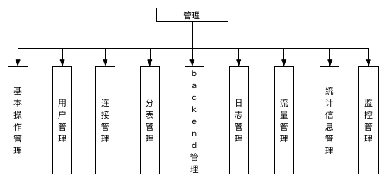

### 3.3.1 基本操作管理      
<h1 id="3.3.1"></h1>

基本操作管理主要是对DBProxy本身的一些管理，诸如：设置DBProxy启动时所属的用户、DBProxy监听的端口号、DBProxy版本信息、DBProxy平滑关闭等等信息，下面一一介绍。     

#### 3.3.1.1 启动用户设置     
<h1 id="3.3.1.1"></h1>

**功能概述**    
以root用户启动DBProxy时，可以配置非root用户启动DBProxy；以非root用户启动DBProxy时，该参数失效。该参数生效时，DBProxy启动时所创建的文件（如日志文件、配置文件所在文件夹等）的拥有者均为所配置的用户。    

**使用方法**     
使用user参数进行配置，支持配置文件与命令行参数两种方法设置。    

在非root用户下，不能进行user参数的配置。在root用户下，可以不配置user参数，此时则以root用户启动DBProxy；配置user参数时，需要保证所配置的用户在当前系统存在且对所需要访问的文件夹、文件具有对应权限（如果没有对应权限，可以查看系统启动失败的日志）。     

在配置文件中配置user参数的方法如下所示：    

```
user=username                   
```

命令行中配置user参数的方法如下所示：    

```
$proxydir --defaults-file=$proxydir/conf/$confile --user=mysql      
```

在admin端口也可以查看当前DBProxy所配置的用户，命令如下：     

```
show variables like 'user';       
```

例如，当前系统中存在root用户与mysql用户，在配置文件中，将DBProxy启动的用户设置为mysql，配置如下所示：     

```
user=mysql      
```

在root权限下启动DBProxy，使用如下命令查看DBProxy的进程：    

```
ps -ef | grep proxy    
```

发现当前DBProxy所属的用户为配置文件中所配置的mysql，与此同时，对应的日志文件的所属用户也变成了所配置的mysql用户了：    

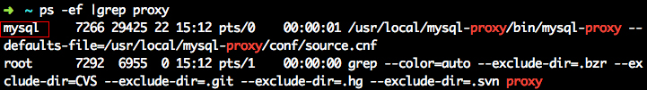    
    
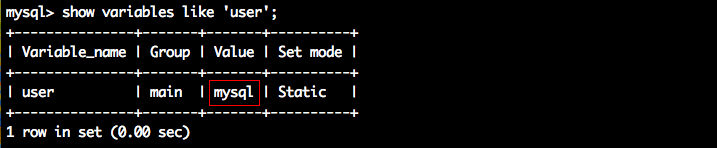    

#### 3.3.1.2 平滑关闭    
<h1 id="3.3.1.2"></h1>

**功能概述**    
该功能支持DBProxy立即关闭和平滑关闭。立即关闭是指立即结束DBProxy进程；平滑关闭是指若有正在执行的事务，等待shutdown-timeout时间，如果仍有执行的事务，则直接结束DBProxy进程。    

**使用方法**      
配置文件中可以设置shutdown-timeout的值，设置方法如下：    

```
shutdown-timeout=$int      #配置文件中设置sutdown-timeout参数                   
```

配置文件中设置完成之后，可以登录admin端口，可以通过如下命令来查看配置是否已经被成功加载：      

```
show variables like 'shutdown-timeout';             
```

例如，在配置文件中设置shutdown-timeout的值为500s，则设置方法如图：    

    

登录admin端口查看配置是否被成功加载：    

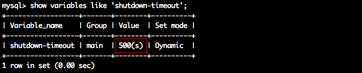    

在admin端口也可以对shutdown-timeout的值进行动态设置，admin端口的命令格式如下：   

```
set shutdown-timeout=$int              
```

例如，在admin端口将shutdown-timeout参数设置为3600s，则设置方法如图：    


DBProxy的平滑下线，使用到的admin端口的命令如下：    

```
shutdown [NORMAL|IMMEDIATE];               #NORMAL:平滑下线    IMMEDIATE:立即下线                   
```

DBProxy进程会立刻被终止，退出；而同样的场景下，执行平滑关闭，则会等shutdown-timeout时间，若果在shutdown-timeout时间内，不再有事务中的连接，则DBProxy退出，如果在shutdown-timeout之后仍旧存在连接，则DBProxy进程会立即被终止。

#### 3.3.1.3 服务端口的设置   
<h1 id="3.3.1.3"></h1>

**功能概述**      
DBProxy可以对admin和proxy所监听的端口进行设置，用户在连接admin和proxy的时候，需要指定对应的端口号。    

**使用方法**     
目前仅能够在配置文件中进行端口的设置，设置方法如下：      

```
admin-address=0.0.0.0:3307         #admin端口号配置                
proxy-address=0.0.0.0:3308         #proxy端口号配置                
```

启动DBProxy之后，可以通过如下命令查看该参数配置是否正确：    

```
show variables like 'admin-address';     #查看admin端口的配置                     
show variables like 'proxy-address';     #查看proxy端口的配置               
```

例如，查看当前DBProxy的admin 和 proxy 端口的配置，截图如下所示：    

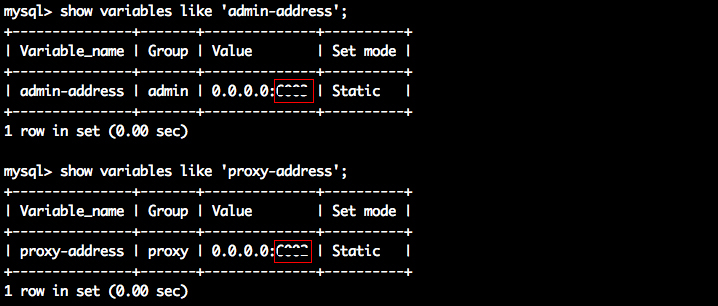    

#### 3.3.1.4 版本查看    
<h1 id="3.3.1.4"></h1>

**功能概述**    
在DBProxy启动之前或之后，均可以查看DBProxy版本信息。    

**使用方法**     
在DBProxy启动之前，可以使用如下方法查看DBProxy的版本信息：     

```
$install_path/bin/mysql-proxy --version           
```

例如，在当前DBProxy安装路径为：/usr/local/mysql-proxy，则查看当前安装的DBProxy版本的命令为：/usr/local/mysql-proxy/bin/mysql-proxy --version，显示版本信息的结果如下图所示：    

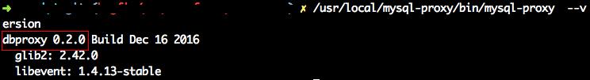    

在DBProxy启动之后，可以通过登录admin端口，对DBProxy的版本信息进行查看。在admin端口查看的指令如下所示：    

```
select version;            #查看当前DBProxy的版本号                 
```

例如，查看当前启动的DBProxy的版本信息，则登录admin端口执行上述命令可进行查看，如下图所示：    

   

#### 3.3.1.5 DBProxy运行方式设置    
<h1 id="3.3.1.5"></h1>

**功能概述**     
DBProxy本身的运行方式分为两种：1 前台运行方式 2 后台运行方式。DBProxy在配置文件中也可以对不同类型的运行方式进行配置，具体配置方法下面将进行详述。    

**使用方法**      

```
#设置DBProxy的运行方式，设为true时为守护进程方式，设为false时为前台方式，一般开发调试时设为false，线上运行时设为true                 
daemon=false            
```

在DBProxy启动后，可以登录admin端口，使用如下命令对该参数进行查看：    

```
show variables like 'daemon';           
```

例如，查看当前启动的DBProxy的运行方式，截图如下所示：    

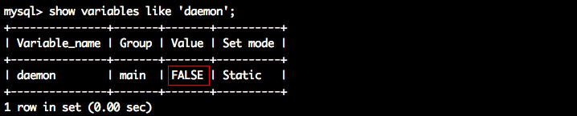    

#### 3.3.1.6 DBProxy监控进程配置   
<h1 id="3.3.1.6"></h1>

**功能概述**     
为了增加DBProxy的可用性，允许在DBProxy启动的同时，另外启动一个监控进程。当DBProxy意外退出时，该监控进程会自动启动退出的DBProxy，该监控进程是否启动，也可在配置文件中进行配置。   

**使用方法**     

```
#设置DBProxy的运行方式，设为true时DBProxy会启动两个进程，一个为monitor，一个为worker，monitor在worker意外退出后会自动将其重启，设为false时只有worker，没有monitor，一般开发调试时设为false，线上运行时设为true                  
keepalive=FALSE|TRUE           
```

在DBProxy启动之后，可以登录admin端口对该参数进行查看，查看的命令如下：    

```
show variables like 'keepalive';           
```

例如，查看当前启动的DBProxy是否配置了监控进程，截图如下所示：    

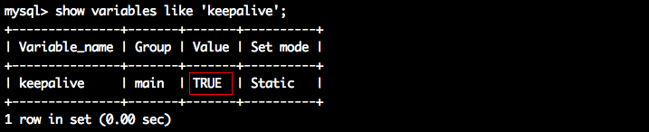    

当然，初了使用admin端口的相关命令查看，也可以直接查看启动的进程中是否有监控进程，如下图所示，则表示了已经启动的监控进程:    

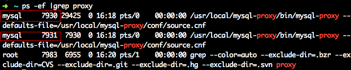    

####3.3.1.7 工作线程数量设置    
<h1 id="3.3.1.7"></h1>

**功能概述**  
DBProxy中建立的连接请求的实际处理者均为工作线程，为了提高DBProxy的并发量，可以配置多个工作线程，工作线程的数量可以在配置文件中进行配置。    

**使用方法**     

```
#工作线程数，对DBProxy的性能有很大影响，可根据情况适当设置,默认为1         
event-threads=16        
```

在DBProxy启动之后，可以登录admin端口对该参数进行查看，命令如下：   

```
show variables like 'event-threads';            
```
  
例如，查看当前启动的DBProxy所拥有的工作线程数量，截图如下所示：    

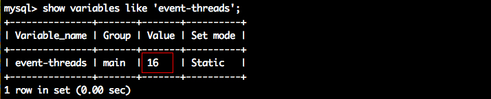         

#### 3.3.1.8 实例名称设置    
<h1 id="3.3.1.8"></h1>

**功能概述**    
每个DBProxy启动时需要指定实例名称，实例名称可以在配置文件中进行配置。    

**使用方法**    

```
#实例名称，用于同一台机器上多个DBProxy实例间的区分        
instance=source            
```

在DBProxy启动之后，可以登录admin端口对该参数进行查看，命令如下：    

```
show variables like 'instance';         
```

例如，查看当前启动的DBProxy所拥有的工作线程数量，截图如下所示：    

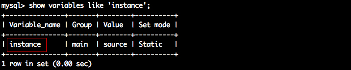   

#### 3.3.1.9 查看启动命令行支持的命令    
<h1 id="3.3.1.9"></h1>

**功能概述**    
DBProxy启动时，除了在配置文件中配置启动参数外，也可以在启动命令行对参数进行指定。可以通过启动命令行所提供的帮助命令，查看启动命令行锁支持的启动配置参数。    

**使用方法**
可以通过如下命令查看启动命令行所支持的命令行参数，以及各个参数的用法：   

```
$instance_path/bin/mysql-proxy --defaults-file=$config_file_path/config_file_name.cnf --help          
```

*注：由于启动命令行所支持的参数在配置文件中均可配置，因此在介绍各个参数配置时，主要介绍在配置文件中的配置方法，启动命令行中配置方法类似，具体配置方法可以通过上述命令进行查看，因此进行了忽略。*    

例如，当前DBProxy的安装目录为：/usr/local/mysql-proxy，配置文件所在的目录为：/usr/local/mysql-proxy/conf/，则查看当前安装的DBProxy所支持的启动命令行参数，截图如下所示：   

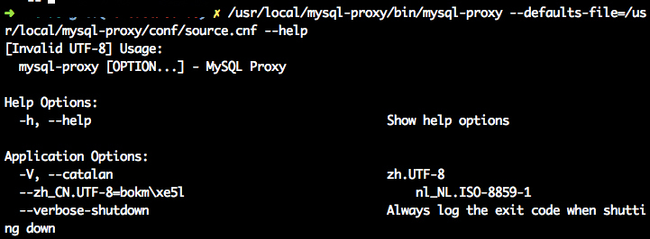   

#### 3.3.1.10 查看admin端口支持的命令   
<h1 id="3.3.1.10"></h1>

**功能概述**    
admin端口提供了用来查看当前admin端口所提供的所有的命令，可以通过该功能进行查看。   

**使用方法**    
在admin端口，使用下述命令进行查看当前admin端口所提供的所有命令。    

```
select * from help;         
```

例如，在admin端口执行结果如下图所示：    

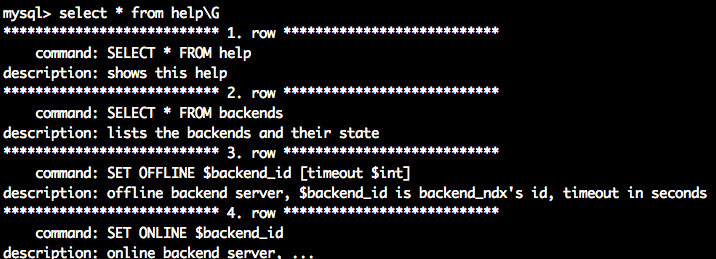  

#### 3.3.1.11 参数保存    
<h1 id="3.3.1.11"></h1>

**功能概述**    
该功能允许用户对DBProxy参数的修改保存到磁盘中的配置文件中。    

**使用方法**    
当用户连接dmin端口后，通过以下语法，对DBProxy当前的配置信息进行永久性保存：    

```
save config;           
```

例如，对当前DBProxy的配置参数希望永久性的存入磁盘中的配置文件中，则执行 save config操作即可：    

 

当然，如果当前配置文件不存在或是修改了名字等，则会出现 save config 失败：   

   

如果该配置文件写入失败时，则同样会造成save config 失败：    

   

### 3.3.2 用户管理   
<h1 id="3.3.2"></h1>

DBProxy中的用户可以分为三类：admin用户，proxy用户和monitor用户。admin用户是用来连接DBProxy管理端口的，连接之后可以对DBProxy进行设置；proxy用户是用来连接proxy端口的，连接时候可以操纵后台数据库；monitor端口是在DBProxy系统监控各个backends所需要的用户。下面将依次展开介绍。    

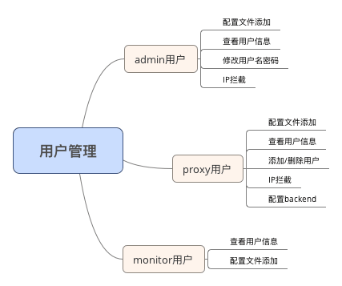    

#### 3.3.2.1 admin 用户   
<h1 id="3.3.2.1"></h1>

**功能概述**    
DBProxy允许管理员对admin的用户进行配置、查看和修改，以及对IP拦截的配置，下面将依次展开介绍。   

**使用方法**   
- 配置文件中的相关配置    

```
admin-username=$user_name;              
admin-password=$pwd;                 
admin-user-hosts=$ip[,$ip];              
```

- 查看用户信息   

```
select * from pwds;       
```

在连接admin端口之后，可以使用命令：select * from pwds; 来查看admin 和 proxy 用户信息，显示的各字段的含义如下：   

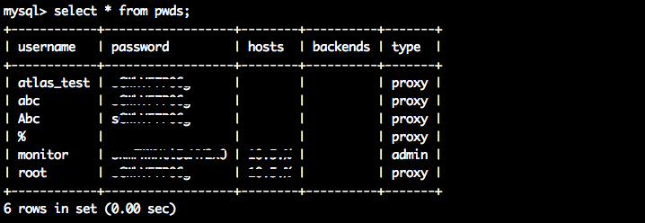   

<table  align="left" style="width : 100%;"> 
<tr>
	<th>字段名称</th>
	<th>含义</th>
</tr>
<tr align="left">
	<td>username</td>
	<td>用户名</td>
</tr>
<tr align="left">
	<td>password</td>
	<td>密码（encrypted_pwd）</td>
</tr>
<tr align="left">
	<td>hosts</td>
	<td>用户对应的白名单ip</td>
</tr>
<tr align="left">
	<td>backends</td>
	<td>proxy用户名下绑定的bakcend(以tag名的形式标记)</td>
</tr>
<tr align="left">
	<td>type</td>
	<td>类型信息。proxy:proxy端口的用户 admin:admin 端口的用户</td>
</tr>
</table>

- 动态修改admin用户名密码    
连接admin端口之后，可以使用下述命令进行用户名/密码的动态修改：  

```
alter admin user $username:$password   #修改admin的用户名和密码，参数用户名和密码均不能空
```

例如，查看当前用户名和密码，如下所示：   

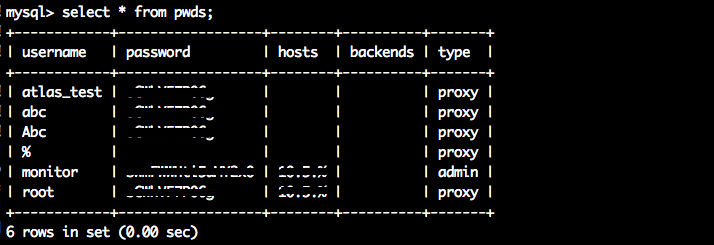

使用下面指令尝试修改admin的用户名和密码：   


再次查看用户信息，发现已经修改完成用户名和密码：   

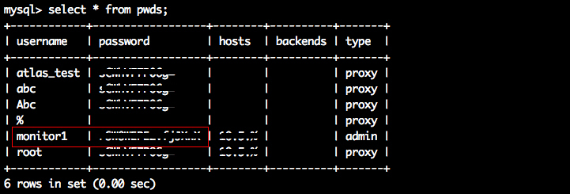   

- IP拦截   
该功能可以设置连接admin端口的ip白名单，从而加强对admin账号的安全管理，限制部分ip对admin端口的登录请求，即只有在白名单内的ip才能够允许连接admin端口（不设置时，默认不限制）。      
在配置文件中配置该参数的方法如下所示：    

```
admin-user-hosts=$ip[,$ip]        #可以配置多个ip,之间使用逗号分隔    
```

在admin端口的命令行中设置的方法如下：   

```
add admin user hosts $ip[,$ip];   #可以添加多个ip,之间使用逗号分隔      
remove admin user hosts $ip[,$ip] #可以删除多个ip,之间使用逗号分隔        
```

*特别注意*，在输入的ip中，最多可以使用一个通配符%，例如允许的ip形如：%，128.% ，127.1.%，126.1.2.%；当所添加的ip之间具有包含关系时，只会保留较大范围的ip的配置，例如，配置如下时，最终添加到白名单的只有127.%。     

```
add admin user hosts 127.1.1.1,127.2.1.3,127.%;       
```

配置完成之后，可以通过admin端口命令行输入如下命令进行查看：   

```
select * from backends;      
```

该功能支持 saveconfig。   

例如当前DBProxy中没有对admin用户monitor用户的hosts进行配置，如下所示：     

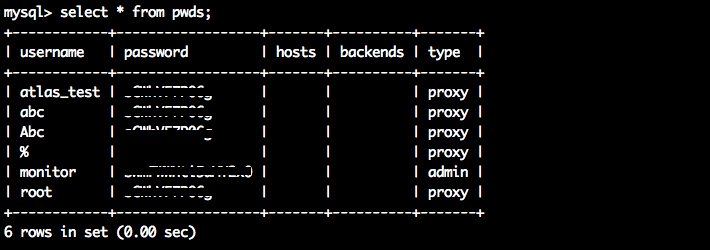     

为monitor用户增加白名单 10.1.1.1 ，即只允许ip 为 10.1.1.1 连接admin端口，查看配置结果：
 
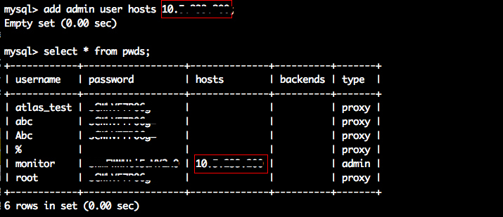   

使用ip为10.2.2.2的主机连接admin端口时，连接admin端口会被拒绝，而使用ip为10.1.1.1 的主机连接admin端口时，则可以正常连接：    

   
   

#### 3.3.2.2 proxy用户   
<h1 id="3.3.2.2"></h1>   

**功能概述**   
DBProxy允许管理员对proxy的用户进行配置、查看和修改，对IP拦截的配置以及设置用户对应的backend，下面将依次展开介绍。    

**使用方法**   
- 配置文件中配置    

```
pwds=usrname:encrypted_pwd[,usrname:encrypted_pwd];      #配置proxy用户名和密码                  
```

- 查看用户信息    

```
select * from pwds;              
```

- proxy用户的增删        
除了在配置文件中配置用户信息之外，也可以通过admin端口对proxy用户信息进行动态管理，相关的命令如下：    

```
select * from pwds;            #查看DBProxy系统中所配置的admin用户和proxy用户信息        
add pwd $usr:$raw_pwd;         #增加一个proxy端口的用户，密码使用原始密码       
add enpwd $usr:$encrypted_pwd; #增加一个proxy端口的用户，密码使用encrypt工具加密后的密码      
remove pwd $usr;               #删除一个proxy端口的用户      
```

例如，添加一个proxy端口账户：（test:123456），其中密码使用原始密码，则添加方法如图所示：    

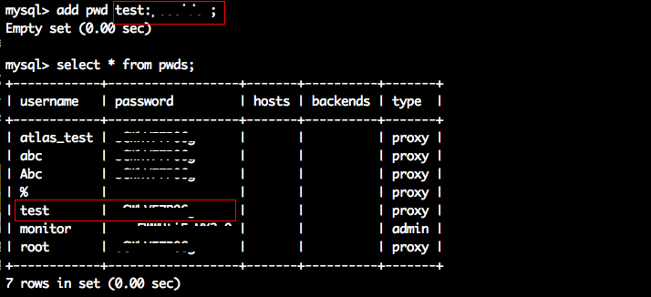   

如果删除某一proxy端口的账户：（test），则删除方法如图：    

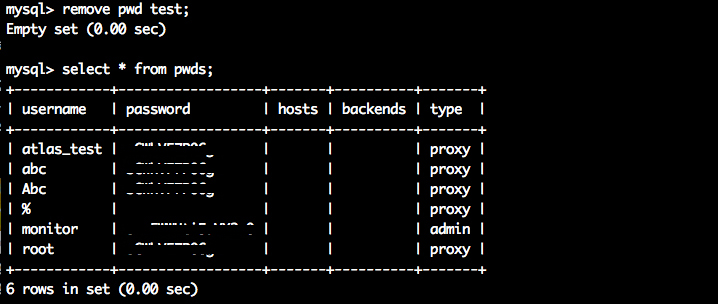   

- IP拦截    
该功能提供用户对连接proxy的用户的ip进行限制的功能。DBProxy系统提供一个白名单，即配置在%用户下的host白名单；同时各个用户也可以在所在的用户名下配置该用户私有的白名单。因此，当DBProxy做host权限检查时，如果配置了系统白名单（%用户名下的），先要在该系统白名单中匹配成功，而后再从对应的用户的白名单中匹配成功才能够进行连接proxy。当然，白名单如果没有配置则表示不受限，其host权限认证流程如下所示。    

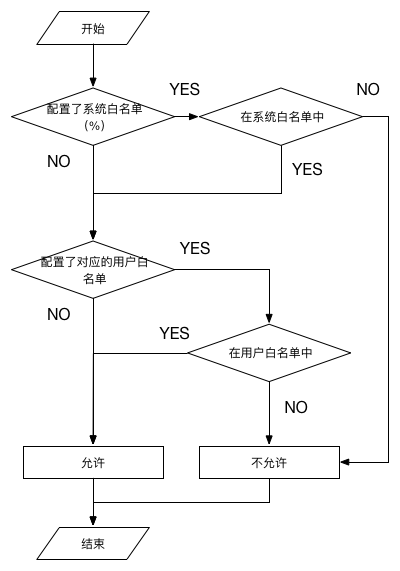   

添加、删除DBProxy**系统白名单**的语法如下：    

```
add user hosts %@host[|host];       #为系统白名单添加一个或多个host              
remove user hosts %@host[|host];    #为系统白名单删除一个或多个host           
remove user hosts %;                #删除系统白名单         
```

例如，为系统白名单设置host：10.1.1.1和10.2.2.2，其设置方法如下：    

```
add user hosts %@10.1.1.1|10.2.2.2;           
```

执行上述命令后，使用 select * from pwds 命令查看hosts情况，如下：    

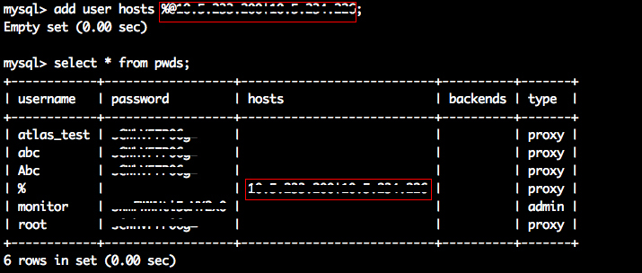   

删除root用户下host：10.1.1.1 时，其设置方法如下：    

```
remove user hosts root@10.1.1.1;            
```

执行上述命令后，使用select * from pwds命令查看hosts情况，如下：    

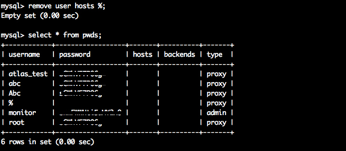   

如何没有设置白名单，则表示可以允许任意IP连接；如果设置了白名单，则只允许白名单内的IP进行连接。特别的，连接proxy端口时，只有通过系统白名单的检查和用户白名单的检查之后，才允许进行连接。    

例如：不设置系统白名单，仅仅设置root用户的白名单host:10.1.%，此时，系统白名单由于没有设限，而root用户的白名单设限了，因此如果root账号连接，仅仅需要判断所连接的host在root用户白名单内即可。按照当前配置，只有host为10.1.%才允许连接。    

使用host：10.1.1.1 连接，则能够正常连接，如下：    

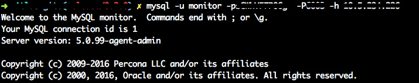   

使用host: 10.2.2.2 连接，则连接被禁止，如下：    

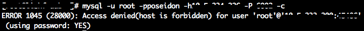   

在之前的基础上，在DBProxy系统白名单中设置host: 10.2.2.2，此时，host：10.1.1.1 的主机也不能够正常连接，因此系统白名单中配置了只允许host: 10.2.2.2的主机进行连接，如下：    

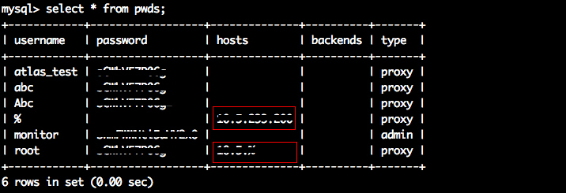   
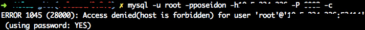   

- backend配置    
该功能允许对proxy用户绑定从库，用户绑定可用从库之后，使用该用户的连接所执行的数据库操作指令优先发往所配置的从库。从库的配置使用的是从库配置的标签。    

配置文件中的配置方法如下：    

```
user-backends=$user_name@$tag_name[|$tag_nam2][,$user_name@$tag_name[|$tag_nam2]];      
```

例如，为proxy 用户root配置tag_mt， 为proxy用户DBProxy_test配置tag_mt和tag_dp，则在配置文件中的配置应该为：    

```
user-backends=root@tag_mt,dbproxy@tag_mt|tag_dp;       
```

使用select * from pwds;命令查看可以发现上述配置已经被成功的加载，如下图所示：    

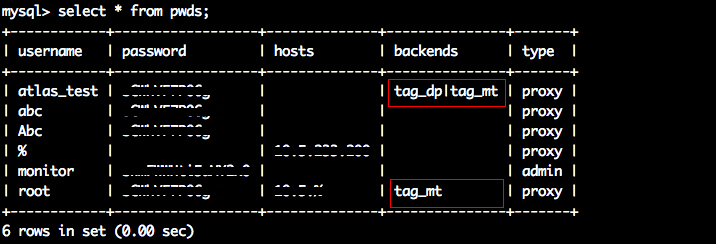    

在admin端口可以对用户所配置的tag进行动态的增加、删除（大小写敏感），命令如下：   

```
add user backends $username@$slave_tag[|$slave_tag];            
remove user backends $username@$slave_tag[|$slave_tag];               
remove user backends $username;             
```

例如，删除proxy用户dbproxy_test上所有的tag，可以命令如下：   

```
remove user backends dbproxy_test;              
```

执行结果如下图所示：

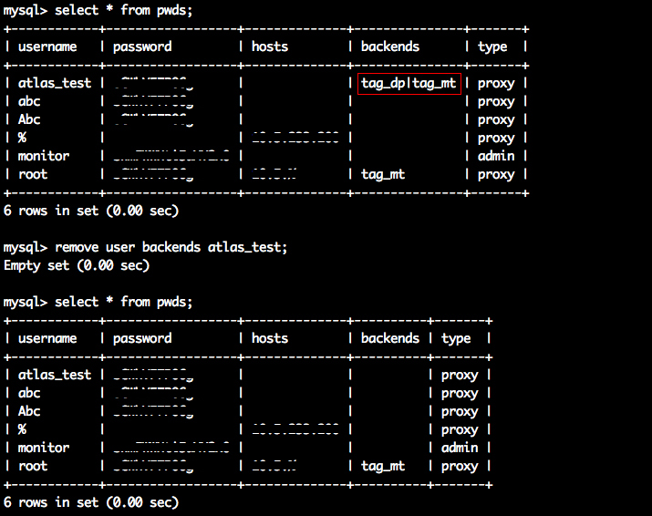    

再例如，为proxy端的用户root删除tag_mt并为proxy用户DBProxy_test添加tag_mt，则可以使用命令如下：   

```
remove user backends root@tag_mt;        
add user backends dbproxy_test@tag_mt;           
```

截图如下所示：   

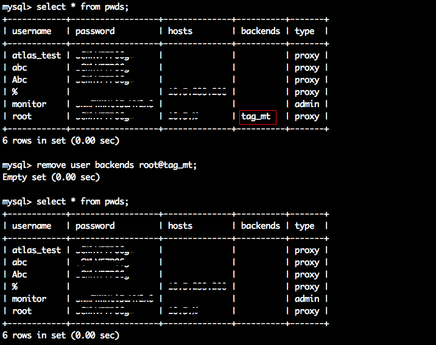   
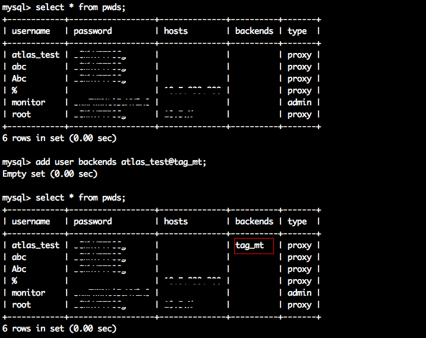   

#### 3.3.2.3 monitor用户   
<h1 id="3.3.2.3"></h1>

**功能概述**    
DBProxy允许管理员对monitor的用户进行配置和查看，下面将依次展开介绍。    

**使用方法**    
在配置文件中配置：     

```
backend-monitor-pwds=usrname:raw_pwd;         
```

在admin端口查看用户信息：       

```
show variables like 'backend-monitor-pwds';         
```

例如，在配置文件中配置了用户名和密码，截图如下：    

   

启动DBProxy之后，可以使用命令 show variables like 'backend-monitor-pwds' 进行相关的查看。    

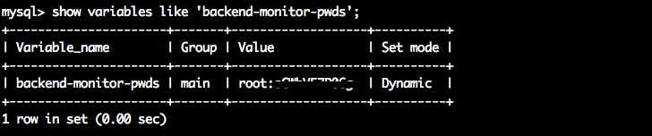  

### 3.3.3 连接管理   
<h1 id="3.3.3"></h1>

在DBProxy中，允许查看和设置与连接相关的信息。下面将意义叙述。    

#### 3.3.3.1 查看当前连接    
<h1 id="3.3.3.1"></h1>

**功能概述**    
DBProxy允许管理员查看当前连接DBProxy的所有连接的信息，这其中包括对admin端口的连接和对proxy 端口的连接。    

**使用方法**    

```
show processlist;              
```

例如，使用上述命令查看当前DBProxy的连接数，查询结果如下图所示：    

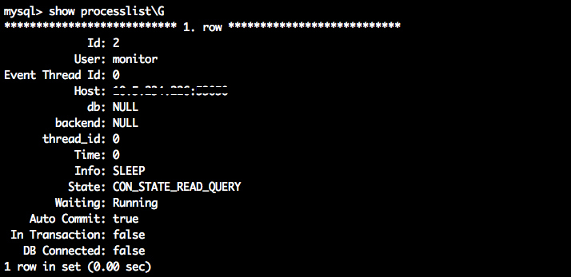

#### 3.3.3.2 结束连接    
<h1 id="3.3.3.2"></h1>

**功能概述**    
该功能允许管理员通过登录admin端口，将当前执行的某个连接进行立即关闭。    

**使用方法**    
如果由于某种原因，希望关闭某一连接时，可以使用如下命令：    

```
kill [connection] $connect_Id   #connect_Id = $connect_Id的连接     
```

通过show processlists;命令，可以获得每个连接的ID，通过连接的ID，即可对指定连接进行关闭。     

#### 3.3.3.3 连接相关的参数   
<h1 id="3.3.3.3"></h1>

**功能概述**   
对于DBProxy来说，管理的连接主要有两类：1 客户端连接DBProxy的连接 2 DBProxy连接backend的连接。因此，对连接的设置也是针对这两类连接进行的。    

**使用方法**    
在配置文件中对连接相关的参数的设置方法如下所示：    

```
max-connections=$int             #客户端连向DBProxy最大连接数               
wait-timeout=$int                #客户端连向DBProxy的空闲连接等待超时时间         
db-connection-idle-timeout       #连接池中的db连接的空闲超时             
db-connection-max-age            #db连接的最大生命周期             
check-state-conn-timeout         #监控backend信息时，连接backend的超时，默认1s         
```

在admin端口可以执行的命令如下所示：    

```
show variables like '$arg';      #用来查看相关参数,$arg代表需要查询的参数        
set max-connections=$int;        
set wait-timeout=$int;        
set db-connection-idle-timeout=$int;     
set db-connection-max-age=$int;    
set check-state-conn-timeout=$int;         
```

### 3.3.4 分表管理   
<h1 id="3.3.4"></h1>

#### 3.3.4.1 分表的配置   
<h1 id="3.3.4.1"></h1>

**功能概述**    
目前DBProxy线上使用的版本支持分表功能，分表策略目前为：hash。分表的配置可以在配置文件中进行配置，但是在0.2版本及其后的版本支持在admin端口对分表进行动态的配置。    

**使用方法**   
配置文件中配置格式如下：    

```
tables=dbname.tablename.shardcolname.shardnum[,dbname.tablename.shardcolname.shardnum]           
##dbname:数据库名称  tablename:分表的表名  shardcolname:分表键   shardnum:分表个数
```

*注意：*   
	1. 如果分表的表名为：tbl ，则子表的命名应为：tbl_idx，例如tbl_0， tbl_1 ...    
	2. 如果分表个数为shardnum，则子表序号从0开始到shardnum-1终止   
	3. 目前只支持同一个库上的分表，且每个表上只支持一个分表键   
	4. 目前对分表上数据的操作有一些限制，需要特别注意   

例如，在数据库名：DBProxy 中创建了两个表名：shard 的子表：shard_0， shard_1，分表个数为2，规定分表键为：a，如下所示。   

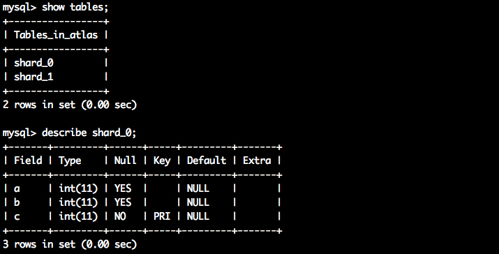   

则需要再配置文件中进行配置如下：   

```
tables=dbproxy.shard.a.2  #数据库:DBProxy  数据表:shard  分表键:a   分表个数:2     
```

配置完成之后，启动dbproxy，可以连接Admin端口查看配置是否生效，其查看方法如下所示。 

```
show tables;                      #查看系统配置的全部的分表信息     
show tables like 'dbname.tbl.a.2';    #查看系统配置的 分表信息dbname.tbl.a.2  是否生效     
```

上述命令的查询结果如下图所示。   

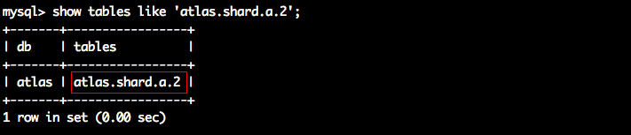    

除了在配置文件中配置分表信息之外，也可以从Admin上进行分表信息的添加和删除，其语法如下：   

```
add tables 'dbname.tbl.shardcolname.sharnum'; #增加一列分表信息：dbname.tbl.shardcolname.sharnum         
remove tables like 'dbname.tbl'; #删除一列分表信息：dbname.tbl          
```

配置完成之后，就可以连接Proxy端口进行数据库的访问了。     
*注意*：删除分区表时，参数是 db.name.tbl  而非完整的分表信息。   
通过save config; 命令，可以将Admin端口修改的分表信息保存到配置文件中。   

#### 3.3.4.2 分表限制   
<h1 id="3.3.4.2"></h1>

**功能概述**    
由于DBProxy对分表的支持力度有限，因此分表使用时有一定的限制，下面将对限制进行说明。  

**使用方法**    
目前DBProxy对于分表的限制如下：    

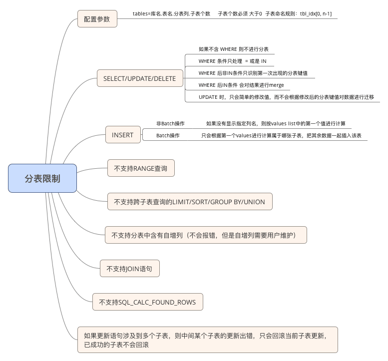    

### 3.3.5 backend管理   
<h1 id="3.3.5"></h1>

对backend的操作主要是对backend的配置以及对backend的过载保护。backend的配置主要包括对bakend信息的查看、对backend的增删改，以及对backend的属性的修改，包括backend的权重、tag、状态等信息的操作。接下来将对该部分一一详述。    

#### 3.3.5.1 backend的配置    
<h1 id="3.3.5.1"></h1>

**功能概述**    
DBProxy启动之前需要在配置文件中配置backend信息。backend按照读写分类，可分为读写backend库(可以读写操作)和只读backend库（仅可以读操作），其中在配置文件中读写backend库是必须配置的。     

连接DBProxy的客户端所发送的sql语句，根据DBProxy内部的策略，会将sql语句发送至特定的backend库执行。   

**使用方法**     
配置文件中可以对主库和从库进行配置，配置语法如下：    

```
proxy-backend-addresses=host:port[,host:port];               
proxy-read-only-backend-addresses=host:port[$tag_name@weight][,host:port[$tag_name@weight]]     #配置从库的ip地址，端口号，可选配置该主库的标签名称和权重，默认权重1。           
```

例如，配置一个读写库，其ip地址为:1.1.1.1，端口为3306；配置两个只读库，从库1的ip地址为：1.1.1.1，端口为：3306，标签名称为：tag_mt，权重为10；从库2的ip地址为：2.2.2.2，端口为：3306，不配置标签名称和权重，该配置文件应如下：    

```
proxy-backend-addresses=1.1.1.1:3306;       
proxy-read-only-backend-addresses=1.1.1.1:3306$tag_mt@10,2.2.2.2:3306;           
```

实际配置文件的配置截图如下：   

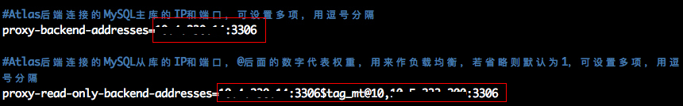   

启动DBProxy，登录admin端口，可以使用命令：select * from backends; 来查看配置是否生效，截图如下：     

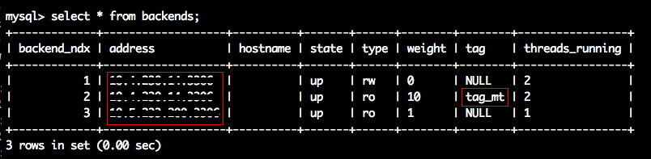

除了在配置文件中可以对backend进行配置之外，也可以登录admin端口对backend进行管理。在admin 端口，可以增加、删除backend，并且可以设置删除backend的最大等待时间，与此同时，也可以通过命令对backend的状态在online与offline之间自由切换，admin端backend操作的命令如下：    

```
select * from backends;                     #对backends相关的信息进行查看        
add master $backend;                        #增加一个主库backend,增加的主库backend的格式同配置文件            
add slave $backend;                         #增加一个从库backend,增加的从库的backend的格式同配置文件                
remove backend $backend_ndx [timeout $int]  #删除一个backend_ndx的库，与此同时可以指定超时时间           
set remove-backend-timeout = $int           #设置全局的删除backend的超时时间      
set online $backend_ndx;                    #设置一个backend_ndx的库的状态为online状态           
set offline $backend_ndx;                   #设置一个backend_ndx的库的状态为offline状态           
```

一般使用命令：select * from backends来查看当前系统中的backends信息，其中显示的字段含义如下：   
<table  align="left" style="width : 100%;"> 
<tr>
	<th>字段名称</th>
	<th>含义</th>
</tr>
<tr align="left">
	<td>backend_ndx</td>
	<td>
		每个backend的索引值，该值是动态变化的，从1开始依次排序，主库序号靠前   
	</td>
</tr>
<tr align="left">
	<td>address</td>
	<td>
		backend的主机ip和port 
	</td>
</tr>
<tr align="left">
	<td>hostname</td>
	<td>
		显示ip地址对应的主机名称
	</td>
</tr>
<tr align="left">
	<td>state</td>
	<td>
		显示backend的状态。状态有：UP/DOWN/REMOVING/OFFLINE/OFFLING
	</td>
</tr>
<tr align="left">
	<td>type</td>
	<td>
		代表backend的类型。类型有：rw:主库，可进行读写操作 ro:从库，只可进行读取操作
	</td>
</tr>
<tr align="left">
	<td>weight</td>
	<td>
		代表从库的权重。主库权重为0，代表其没有权重属性；从库的权重最小值为1
	</td>
</tr>
<tr align="left">
	<td>tag</td>
	<td>
		backend的标签名
	</td>
</tr>
<tr align="left">
	<td>threads_running</td>
	<td>
		当前backend上正在运行的并发线程数
	</td>
</tr>
</table>

add master 与 add slave 命令可以动态的增加主库和从库，例如增加一个从库(1.1.1.1:3306)，可以直接在admin 端口执行：  

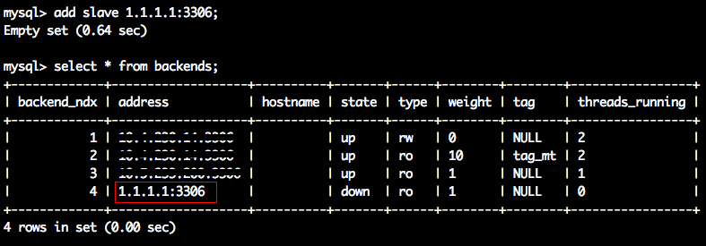  

remove backend 命令可以动态的删除一个主库或是从库，例如删除backend_ndx=4的从库，可直接在admin 端口执行remove backend 4，查看结果：   

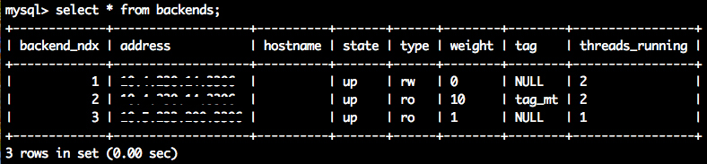    

在删除过程中，如果当前待删除的库正在事务中，则可以设置等待时间，没有设置等待时间，则参考系统全局的remove-backend-timeout的值。若当前backend中有连接在事务中，则等待该事务完成，若超过等待时间，该事务仍旧没有执行完，则强制对backend进行删除。可以通过set remove-backend-timeout命令对全局的remove-backend-timeout进行设置，设置之后可以通过show variables like 'remove-backend-timeout'命令进行查看；或是在执行remove backend命令时，后跟timeout参数。    

设置全局的remove-backend-timeout = 3600s，并查看设置结果：   

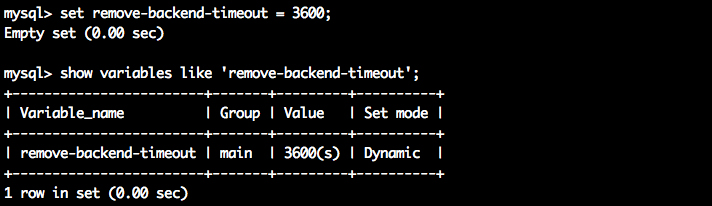

使用remove backend 指定timeout效果一样，例如，删除backend_ndx=1的主库，等待时间设置为10s，删除时主库在长事务中，则删除命令为：remove backend 1 timeout 10; 执行结果截图如下：   

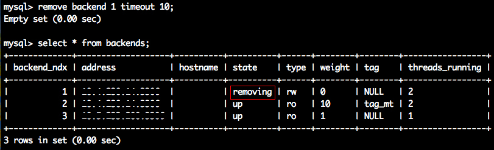   

由于当前待删除的backend上有长事务，因此删除后，其会等待事务结束再移除backend，因此此时其状态为removing。10s之后，长事务仍旧没有没有结束，因此系统会强制删除该backend，再次查询发现，该backend已经被删除成功。   

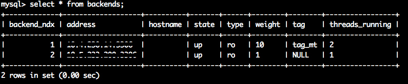   

同样的，使用命令：set online / set offline 可以设置某一处于offline状态的backend为online状态，也可以设置某一正处于online状态的backend为offline。需要注意的是，online是一个状态集合包括了：UP/DOWN/KNOWN。set offline命令与remove backend命令类似，当该backend 中有处于事务中的连接存在时，需要等待remove-backend-timeout，若等待时间内仍旧存在事务，则进行强制offline。   

例如，将ndx=1 的主库进行offline，该主库存在长事务，此时，使用命令：set offline 1 timeout 10，指定超时10s, 操作截图如下：  

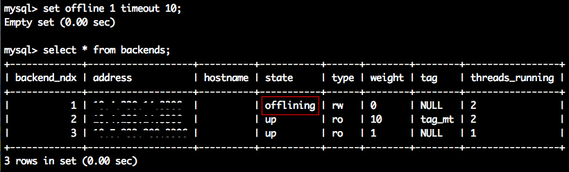

此时发现，ndx=1的主库状态编程offlining，表示正在下线中，等待事务结束。当10s之后，该事务仍旧没有结束，则强制下线，完成下线，截图如下：   

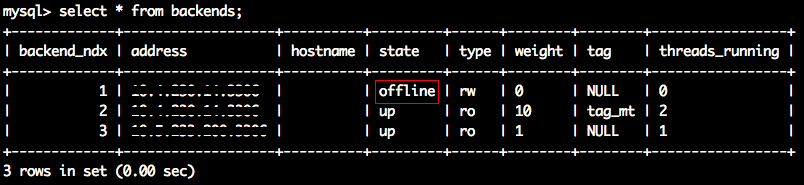

#### 3.3.5.2 backend过载保护   
<h1 id="3.3.5.2"></h1>

**功能概述**    
DBProxy对后端连接的backend也做了一定的保护，限定了每个backend并发的线程数量。当某个backend的并发数高于阈值，则会使当前的连接进行等待，从而对backend进行保护。涉及到的参数有以下两个，接下来将分别介绍。    

```
backend-max-thread-running   
thread-running-sleep-delay    
```

**使用方法**      

- backend-max-thread-running   

该参数设定了每个backend并发的数量。   
在配置文件中，配置方法如下：    

```
backend-max-thread-running=$int;   
```

在admin端口，可以对该参数进行查看和动态修改，命令格式：   

```
show variables like 'backend-max-thread-running'; #查看backend-max-thread-running参数                 
set backend-max-thread-running=$int;              #设置backend-max-thread-running参数，默认为0           
```

例如，在配置文件中，配置backend-max-thread-running的值为1024，则配置文件中的配置如下图所示：   


启动DBProxy之后，连接admin端口后通过命令：show variables;查询backend-max-thread-running值，发现已经从配置文件中加载成功了，如下图所示：    

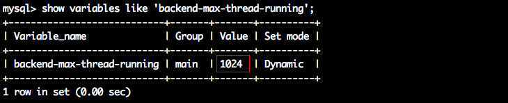

在admin端口修改backend-max-thread-running的值为512，则可以设置如下：   


再次使用命令：show variables;命令查询backend-max-thread-running值，发现已经被修改了，如下图所示：   

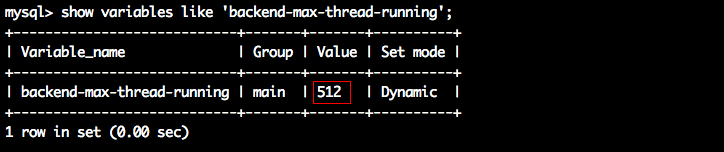  

- thread-running-sleep-delay     
当 backend 的 thread running 数超过 backend-max-thread-running时，新来连接等待thread-running-sleep-delay的时间，其单位是 ms。    

在配置文件中，配置方法如下：   

```
thread-running-sleep-delay=$int            
```

在admin端口，可以对该参数进行查看和动态修改，命令格式：    

```
show variables like 'thread-running-sleep-delay'; #查看thread-running-sleep-delay参数                   
set thread-running-sleep-delay=$int;              #修改thread-running-sleep-delay参数               
```

例如，在配置文件中，配置thread-running-sleep-delay为10ms，则在配置文件中，应该配置如下：   

    

启动DBProxy，连接admin端口，通过命令：show variables;对该参数进行查看，发现配置文件中的配置已经被加载，如图所示：      

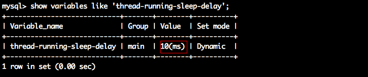

在admin端口设置thread-running-sleep-delay为20ms，命令如下所示：   


再次使用命令:show variables;查看thread-running-sleep-delay的值，已经被修改，如下所示：  

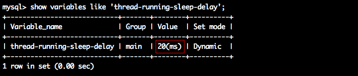

#### 3.3.5.3 backend版本配置   
<h1 id="3.3.5.3"></h1>

**功能概述**   
由于不同的MySQL版本在使用时略有差异，而当前的DBProxy无法自动获取后台连接的DBProxy版本信息，因此在DBProxy中需要手动的配置后台所连接的MySQL的版本信息。该该本信息可以在DBProxy启动之前在配置文件中进行配置，也可以在DBProxy运行期间，通过admin端口提供的命令，对该参数进行动态配置，各配置方法接下来将一一阐述。    

**使用方法**    
在DBProxy中需要对后端连接的MySQL版本进行配置，在配置文件中的配置方法入下：   

```
mysql-version=$version_number              #配置版本号                 
```

该参数也支持在admin端口动态的进行修改，修改该参数的命令如下：    

```
set mysql-version=$version_number;             
```

查看该参数的当前设置，可以使用如下命令进行查看：   

```
show variables like 'mysql-version';         
```

例如，在配置文件中配置MySQL的版本号为5.5，配置方法如下所示:   


启动DBProxy，在admin端口查看当前系统中MySQL的版本号是否为所配置的5.5，截图如下所示:   


在admin对当前的MySQL版本进行动态的修改，修改为5.6，配置截图如下所示：   


### 3.3.6 日志管理   
<h1 id="3.3.6"></h1>

**功能概述**   
DBProxy记录的日志分为两类：DBProxy系统运行日志 和 sql 日志。DBProxy系统运行日志记录了DBProxy自身启动、停止、Admin端口对系统设置等操作的日志；而sql日志则记录了经由DBProxy处理的sql执行的情况的日志。    

DBProxy 允许设置每个日志文件的磁盘容量的大小（sql-log-max-size），也允许设置日志文件最大保留的个数（sql-log-file-num）。   

DBProxy 允许设置日志级别（log-level），也允许设置日志追踪的模块（log-trace-modules）。   
DBProxy 也允许设置sql日志是否打开（sql-log），也可以设置sql日志仅记录大于指定响应时间（sql-log-slow-ms）的sql日志，也可以设置sql日志记录的模式（sql-log-mode）从而选择记录CLIENT端的sql日志或是SERVER端的sql日志，或是记录全部sql日志。   

**使用方法**   
日志生成的目录可以在DBProxy配置文件中进行配置，配置方法如下：   

```
log-path=$path        ##$path  保存日志的绝对路径        
```

通过上述配置，DBProxy系统运行的日志将会保存到$path路径下， 而sql执行的日志则会保存到 $path 路径下，排查故障时可在所配置的路径中找到对应的运行日志文件进行故障分析。   

例如，在配置文件中配置了日志路径，如下：   


在所配置的路径下可以看到历史的DBProxy文件和sql日志的目录，截图如下：    


除了在配置文件中可以配置日志存储的路径，也可以配置保存的日志文件的最大个数，以及单个文件的最大磁盘容量，配置文件中配置如下：   

```
sql-log-file-size=$int        #设置文件最大容量为$int，默认为1G              
sql-log-file-num = $int       #设置最多保存的日志的个数，默认为0                 
```

sql-log-file-num指定了保存日志的最大数量，而当日志磁盘容量大于sql-log-file-size时，便会保存当前日志，并创建新的sql日志。
与此同时，也可以设置sql日志是否记录，设置仅记录指定时间之外的慢日志信息，以及sql日志的模式，设置及含义如下：   

```
sql-log-mode=ALL|CLIENT|BACKEND;#CLIENT:仅记录CLIENT端的日志信息   SERVER:仅记录SERVER端的日志信息   ALL:CLIENT 和 SERVER均记录        
sql-log=ON|OFF|REALTIME; #ON:打开日志记录功能    OFF:关闭日志记录功能    REALTIME:日志实时刷入磁盘    
sql-log-slow-ms=$int; #设置仅记录响应时间超过sql-log-slow-ms的sql日志信息    
```

当然也提供了设置记录日志级别和日志追踪模块选项，设置及含义如下：   

```
log-level=DEBUG|INFO|ERROR|CRITICAL|WARNING|MESSAGE; #日志级别依次降低，高级别日志可以输入低日志的信息，默认CRITICAL                
log-trace-modules=$int; #该选项可以选择日志追踪的模块（连接池：0x01; event:0x02; SQL运行状态:0x04;连接状态: 0x08; 分表: 0x10）     
```

上述功能除了在配置文件中配置之外，也可以在admin端口动态的进行设置，admin端口所支持的log相关的设置如下所示，含义与配置文件中一致：   

```
set sql-log = ON|OFF|REALTIME;          
set sql-log-max-size = $int;               
set sql-log-file-num = $int;                 
set sql-log-mode=ALL|CLIENT|BACKEND;                
set log-level = DEBUG|INFO|ERROR|CRITICAL|WARNING|MESSAGE;               
set sql-log-slow-ms = $int;                  
set log-trace-modules = $int;                                     
```

### 3.3.7 流量管理   
<h1 id="3.3.7"></h1>

DBProxy支持流量管理。在该模块中，可以对某些查询语句做定向发放，也可以对某些语句进行过滤，详细介绍、配置和使用接下来将一一介绍。   
#### 3.3.7.1 SQL 过滤   
<h1 id="3.3.7.1"></h1>

**功能概述**  
该功能可以设置Atla的过滤规则，通过sql语句与过滤规则进行匹配，可以对某些语句进行拦截。sql语句的过滤规则的生成有两种方式：1 手动配置黑名单 2 设置阈值，达到阈值自动添加。下面将详细对sql过滤的功能进行介绍。    

**使用方法**   
- 手动增加过滤条件    
过滤规则的添加是通过设置黑名单对特定类型的而语句进行拦截。黑名单的设置分为两种：1 手动添加 2 自动添加，本节主要介绍手动添加，下一节将介绍自动添加。   

DBProxy允许用户将黑名单保存到文件，在启动DBProxy之后可以加载黑名单、查看黑名单、对黑名单动态的增删改查，与此同时也可以设置黑名单中某些规则是否生效。   

参数 lastest-query-num > 0 的情况下可用。   

在配置文件中，可以配置黑名单文件的路径，也可以配置自动/手动添加的拦截语句是否生效，配置文件中的配置方法如下所示：  

```
blacklist-file=$string;                    #设置黑名单文件所在的路径      
manual-filter-flag=OFF|ON;                 #设置手动添加的拦截语句是否生效，默认是不生效 ON:生效 OFF:不生效                         
auto-filter-flag=OFF;                      #设置自动添加的拦截语句是否生效，默认是不生效 ON:生效 OFF:不生效                        
```

admin端口，可以对该黑名单进行加载、保存、增删改查以及修改某些拦截语句是否生效等，具体命令如下所示:   

```
load blacklists;                   #加载黑名单文件，并读取      
save blacklists;                   #将当前内存中的黑名单保存到磁盘中的黑名单配置文件中               
clear blacklists;                  #将内存中的黑名单全部清空                 
show blacklists;                   #显示内存中的全部黑名单                 
add blacklist 'sql_raw' [0|1];     #增加一条拦截语句sql_raw，并设置该拦截语句是否生效，可以不指定拦截是否生效                             
remove blacklist 'hash_code';      #删除一条拦截语句                     
set blacklist 'hash_code' 1|0;     #设置某一条已经存在的语句是否生效。 1:生效 0:不生效                        
set blacklist-file=$file_path;     #设置黑名单所在的路径                    
set auto-filter-flag=ON|OFF;       #设置自动添加的拦截语句是否默认生效                 
set manual-filter-flag=ON|OFF;     #设置手动添加的拦截语句是否某人生效                  
```

当使用命令：show blacklists;语句时，显示的各个字段含义如下：   

<table  align="left" style="width : 100%;">
<tr>
	<th>字段名称</th>
	<th>含义</th>
</tr>
<tr align="left">
	<td>filter_hashcode</td>
	<td>哈希值</td>
</tr>
<tr align="left">
	<td>filter</td>
	<td>过滤条件</td>
</tr>
<tr align="left">
	<td>is_enabled</td>
	<td>是否生效</td>
</tr>
<tr align="left">
	<td>filter_status</td>
	<td>增加的类型：手工或是自动</td>
</tr>
<tr align="left">
	<td>hit_times</td>
	<td>命中次数</td>
</tr>
</table>

- 自动增加过滤条件  

DBProxy中可以设置过滤选项。设置方法为两种：1 手动配置过滤黑名单 2 设置阈值，当到达阈值自动将当前的规则加入过滤黑名单中，本节将主要介绍设置阈值相关的操作。   

DBProxy允许用户配置过滤规则的阈值，主要涉及三个参数：query-filter-time-threshold、query-filter-frequent-threshold和access-num-per-time-window。   

query-filter-time-threshold参数指 某条语句执行的时间的阈值，执行时间超过该值，则该语句则作为放入黑名单的备选；query-filter-frequent-threshold代表查询频率的阈值，某条语句查询频率超过该值，则也将其作为加入黑名单的备选。如果前两个条件都满足，则将该语句（模板）放入黑名单中。access-num-per-time-window指在一个时间窗口内参考的执行次数的阈值，该参数主要作用是计算出时间窗口time-window=access-num-per-time-window/query-filter-frequent-threshold。上述统计都是基于时间窗口的。   

query-filter-time-threshold值为-1时不参考该值，如果<-1则报错；query-filter-frequent-threshold值为0.0时，不参考该值，如果<0.0时报错；access-num-per-time-window小于1min时，按1min计算；<1时报错；该值的默认为5min。   

配置文件中的配置方法如下所示：   

```
query-filter-time-threshold=$int;             
query-filter-frequent-threshold=$float;            
access-num-per-time-window=$int;                                 
```

在admin端口，可以通过下述命令查看其值以及动态的设置其值：   

```
show variables like '$arg';                #$arg代表查询的参数                
set query-filter-time-threshold=$int;                    
set query-filter-frequent-threshold=$float;                
set access-num-per-time-window=$int;                    
```

- 过滤条件自动生效设置   

过滤条件可以通过手动方法添加或是根据阈值自动添加，但是手动添加或是自动添加过滤规则时，默认该规则是否生效，是通过下列参数进行控制的。   

控制过滤条件是否自动生成的参数，在配置文件中的配置方法如下所示：  

```
#自动添加的过滤条件是否生效，OFF:不生效 ON:生效 ，默认OFF         
auto-filter-flag=OFF|ON              
#手动添加的过滤条件是否生效，OFF:不生效 ON:生效 ，默认OFF           
manual-filter-flag=OFF            
```

在admin端口同样可以对该参数进行配置，配置命令如下所示：  

```
set auto-filter-flag=OFF|ON;      
set manual-filter-flag=OFF;       
```

同样，在配置文件中，也可以对上述参数进行查看，看法方法如下所示：   

```
show variables like '$arg';           #$arg代表要过滤的参数               
```

- lastest-query-num设置   

在过滤功能中计算某类语句的频率时需要将语句保存到链表，lastest-query-num值表示该链表保留语句的上限，该值可以在配置文件和admin端口中被设置。   

在配置文件中的设置方法如下：  

```
lastest-query-num=$int;    
```

同样在admin端口中也可以进行查看和设置，格式如下：   

```
set lastest-query-num=$int;                
show variables like 'lastest-query-num';           
```

例如，在配置文件中，设置lastest-query-num=100000，则配置文件如下图所示：   


启动DBProxy，登录admin端口查看，配置已经被成功加载，如图：  


在admin 端口，将lastest-query-num的值修改为900，则需要执行命令如下：  


再次使用命令：show variables; 查看该参数已经被成功修改了，如下图所示：   


- where条件限制  

通过参数select-where-limit来设置是否限制不带WHERE条件的SELECT语句，ON:限制 OFF:不限制。  

在配置文件中的配置方法如下：  

```
select-where-limit=ON|OFF     #可以设置该参数为ON或OFF          
```

在admin端口可以对该参数进行查看和动态设置，其设置命令为：  

```
show variables like 'select-where-limit';#查看select-where-limit参数         
set select-where-limit=ON|OFF;           #设置select-where-limit参数           
```

- 最近查询语句的查询   

DBProxy提供了显示最近查询语句的信息，命令如下所示：  

```
show lastest_queries           
```

#### 3.3.7.2 从库流量配置   
<h1 id="3.3.7.2"></h1>

**功能概述**

该功能可以通过hint功能指定某个用户的某次请求发送到指定的从库中去。  

该功能涉及到了从库(ro-backend)、标签(slave-tag)和用户(username)三者之间的关系，该三者之间的关系可以通过文氏图进行表示。   

  

通过三者之间的文氏图可以看出，用户名和标签是一对多关系，而标签和从库也是一对多关系，即一个用户名下可以配置多个标签，用户可以通过hint功能指定请求发送到哪个具体标签上，而一个标签可以对应多个从库，即发往该标签的请求，轮询方式发往该标签对应的从库中去。   

**使用方法**   
在配置文件中，配置从库的同时可以指定该从库的标签和从库的权重，配置文件中的配置格式为：slave_ip:slave_port$slave_tagname@slave_weight。   

例如，在配置文件中配置ip为1.1.1.1 port为：3306的从库的标签为 tag_wm，以及权重为 1 的配置文件中的书写方法为：   

```
proxy-read-only-backend-addresses=1.1.1.1:3306$tag_wm@1    
```

启动DBProxy之后，可以通过admin端口登录DBProxy，使用如下命令进行查看。   

```
select * from backends;      
```

在Admin端通过上述命令查看结果如下图所示。   


在Admin端口，DBProxy除了支持proxy账号的管理、从库的管理外，也支持标签的管理和权重的管理。proxy账号管理和从库管理功能相关操作请查看本文档对应章节介绍，本节重点介绍标签的管理和权重的管理。   

标签管理中，可以在Admin端口动态的对某个从库增加或是删除标签，其命令格式如下。  

```
add slave tag $tagname $backend_index[,$backend_index];   #为索引为$backend_index 的从库增加名为$tagname的标签，标签可覆盖                    
remove slave tag $tagname;                                #删除所有从库上名为$tagname的标签                       
remove slave tag $tagname backend_index[,$backend_index]; #删除索引为$backend_index 的从库上的名为$tagname的标签            
```

例如，将上图 backend_ndx = 2 的从库的tagname 修改为：ght，则可以通过下述命令（因为该命令指定的标签可以覆盖已有标签）：         


再次查看从库中的标签，发现该backend_ndx = 2 的从库的标签名字已经被修改为：ght：   


例如，在 DBProxy中存在标签名称均为ght的从库，需要删除所有从库标签名为ght的标签，可以使用下述命令：   


命令执行后，发现从库中凡是标签名称为ght的从库的标签全部被清除：   


当仅仅需要删除某个从库上的指定标签时，例如，仅仅需要删除backend_ndx=3从库上的标签时，可以使用下述命令：   


命令执行后，仅仅backend_ndx=3从库上的标签被清除：  


权重管理中，可以在Admin端口动态修改backend的权重，其命令格式如下：   

```
alter slave weight $backend_index $weight  #修改索引为$backend_index的从库的权重为$weight             
```

例如，修改backend_index = 3从库上的权重，将其权重修改为1024，则可以使用下述命令：  


命令执行后，查看backend_index = 3从库上的权重，已经被修改成为1024   


通过上述配置，可以为从库指定标签名和权重，接下来可以为用户添加对应的标签，每个标签则会对应一个或多个从库。通过以下命令可以查看当前用户和对应从库的标签的关系。  

```
select * from pwds;       
```

例如，查看当前DBProxy中存在的用户基本信息，结果如下图所示：  


可以通过以下命令，修改用户关联的backends：   

```
add user backends $username@$slave_tag[|$slave_tag]; #为用户username增加关联的backends           
remove user backends $username;                    #删除用户username关联的所有backends           
remove user backends $username@$slave_tag[|$slave_tag]; #\删除用户username关联的backends          
```

例如，为当前root用户增加两个backends，则可以使用下述命令：   


查看当前用户信息，已经为root用户增加了两个标签：   


现在已经将root用户与两个从库关联起来了，接下来便可以使用hint功能指定某条语句的流向了。   

首先查看当前root用户所配置的两个backends具体指向的主机:   


现在，使用root用户连接DBProxy，可以使用hint功能指定语句发往的从库了，命令格式如下：  

```
/*slave@$slave_tag*/ sql-statement;   
```

例如，希望当前语句发往tag=tag_dp的从库，则命令如下：   


查看日志信息，发现确实发往了预期的从库：   


同样，如果希望当前语句发往tag=tag_mt的从库，则命令如下：   


查看日志信息，同样该语句发往了预期的从库：   


#### 3.3.7.3 主库流量配置   
<h1 id="3.3.7.3"></h1>

可以指派某条语句发往主库，语法如下：   

```
/*master*/sql-statement;      
```

例如，一条sql：select * from test.sbtest1; 一般查询的sql语句会发往某一从库，如果此时需要其发往主库，则需要使用下述命令：   

```
/*master*/select * from test.sbtest1;    
```

### 3.3.8 统计信息管理   
<h1 id="3.3.8"></h1>

DBProxy提供了信息的统计功能。目前分为两类：1 统计语句执行的响应时间 2 在响应时间统计的基础上支持percentile功能，下面将详细介绍。   

#### 3.3.8.1 响应时间统计   
<h1 id="3.3.8.1"></h1>

**功能概述**  
该功能是对sql语句的相应时间进行统计，其中包括对慢查询的统计。   

**使用方法**    
在配置文件中可以配置是否进行统计以及查询相应时间的底数，配置方法如下所示：   

```
#0：不统计，1：仅统计总体的响应时间，其中包括慢查询，2：进行直方图统计；默认为1        
query-response-time-stats=0|1|2           
#慢查询阈值，查询执行时间超过该阈值则认为是慢查询          
long-query-time=$int         
#查询相应统计时间的底数,通常是2的指数            
query-response-time-range-base=$int           
```

登录admin端口之后，可以对上述参数进行动态的修改，命令如下所示：   

```
set query-response-time-stats=$int;       
set long-query-time=$int;                 
set query-response-time-range-base=$int;           
```

查看上述参数当前的值可以使用如下命令：  

```
show variables like 'query-response-time-stats';         
show variables like 'long-query-time';                 
show variables like 'query-response-time-range-base';             
```

例如，如果希望查看参数，query-response-time-range-base，只需要执行：show variables like 'query-response-time-range-base'，执行结果如下图所示：  


查看统计信息，可以使用如下命令：    

```
show query_response_time;    
```

#### 3.3.8.2 percentile   
<h1 id="3.3.8.2"></h1>

**功能概述**    
该功能允许用户查看最近X分钟（/小时）内，前百分之X的的响应时间（该功能与sysbench中的该功能一致）。   

**使用方法**     
可以在配置文件和admin端口的命令行中进行percentile功能打开/关闭，以及设置系统当前默认的percentile百分比。   

配置文件中配置percentile功能开关状态和percentile百分比的命令格式如下：   

```
percentile-switch=on|off   #设置percentile功能打开（on）或是关闭（off），不配置默认为off            
percentile-value=$th       #设置percentile功能的百分比为$th，范围在：(0,100]，不配置默认为95           
```

例如，在配置文件中配置percentile功能打开，并且百分比为90，则配置文件配置应该如下：   

```
percentile-switch=on    
percentile-value=90      
```

配置文件配置完成之后，启动DBProxy，登录admin端口，使用命令show variables 进行配置的查看：   

```
show variables like 'percentile-switch';       
show variables like 'percentile-value';       
```


如上图，配置文件中的所配置的参数已经正确被DBProxy读取。   

除了在配置文件中配置上述参数之外，也可以在admin端口命令行对该参数进行修改，修改的命令个数如下所示：   

```
set percentile_switch = on|off;  #修改percentile当前开关是打开（on）或是关闭（off ）     
set percentile-value = $th       #修改percentile的默认百分比为$th      
```
 
例如将当前的percentile功能开关关闭，并且修改百分比为10， 则命令如下：   


执行完上述命令之后，再次使用命令show variables 命令查看DBProxy的各个参数，则显示上述命令已经生效。   


当打开percentile功能开关以及设置好百分比之后，则可以查看当前的响应时间了（必须在percentile功能开关打开之后才能查询响应时间）。在admin端口命令行中，使用如下命令进行响应时间的查看：   

```
show percentile [$latest_time];    #查看最近$latest_time时间内的响应时间，如果不输入响应时间，默认为1分钟
```

需要注意的是，命令中的$latest_time，可以是分钟或者是小时。单位为分钟时候，例如最近4分钟可以写成：4m，最大为59m；单位为小时时，例如最近4小时可以写成4h，最大为23h。
 
例如查询最近5分钟内的百分比为10的响应时间，则命令如下（保证当前percneitle功能开关打开）：  


当然，可以使用set percentile来修改此时的百分比，查询不同百分比，最近不同时间段内的响应时间。   

### 3.3.9 监控管理   
<h1 id="3.3.9"></h1>

DBProxy提供了丰富的状态查看端口，管理员可以登录admin端口对运行时各个参数、状态进行监控、管理。各类参数的查看、设置及使用方法，接下来将逐一介绍。   

####3.3.9.1 参数查看    
<h1 id="3.3.9.1"></h1>

**功能概述**
查询当前系统配置的参数信息，可查看的信息如下所示。  
<table  align="left" style="width : 100%;">
<tr>
	<th>Variable_name</th>
	<th>含义</th>
</tr>
<tr align="left">
	<td>access-num-per-time-window</td>
	<td>一个时间窗口内某条语句允许执行的次数</td>
</tr>
<tr align="left">
	<td>admin-address</td>
	<td>DBProxy开发的Admin端口</td>
</tr>
<tr align="left">
	<td>admin-password</td>
	<td>连接admin时的密码</td>
</tr>
<tr align="left">
	<td>admin-username</td>
	<td>连接admin时的用户名</td>
</tr>
<tr align="left">
	<td>auto-filter-flag</td>
	<td>控制自动加入到黑名单的规则默认是否生效</td>
</tr>
<tr align="left">
	<td>backend-max-thread-running</td>
	<td>每个MySQL端并发查询的最大阈值</td>
</tr>
<tr align="left">
	<td>backend-monitor-pwds</td>
	<td>用于监控MySQL状态而设置的连接MySQL的登录密码</td>
</tr>
<tr align="left">
	<td>basedir</td>
	<td>DBProxy的工作目录</td>
</tr>
<tr align="left">
	<td>blacklist-file</td>
	<td>黑名单存储的位置</td>
</tr>
<tr align="left">
	<td>check-state-conn-timeout</td>
	<td>检查状态连接的超时</td>
</tr>
<tr align="left">
	<td>daemon</td>
	<td>TRUE DBProxy后台运行；FALSE DBProxy前台运行</td>
</tr>
<tr align="left">
	<td>db-connection-idle-timeout</td>
	<td>DBProxy连接池中空闲连接的timeout（单位s），超时则该连接从连接池被释放</td>
</tr>
<tr align="left">
	<td>db-connection-max-age</td>
	<td>连接池中连接的生存周期</td>
</tr>
<tr align="left">
	<td>event-threads</td>
	<td>工作线程的个数</td>
</tr>
<tr align="left">
	<td>instance</td>
	<td>当前DBProxy实例的名字</td>
</tr>
<tr align="left">
	<td>keepalive</td>
	<td>	TRUE:开启守护进程 FALSE:不开始守护进程 (守护进程会在DBProxy退出时重启DBProxy)	</td>
</tr>
<tr align="left">
	<td>lastest-query-num</td>
	<td>过滤功能中，计算某类语句的频率时需要将语句保存到链表，该值表示该链表保留语句的上限</td>
</tr>
<tr align="left">
	<td>log-level</td>
	<td>设置日志级别 (日志级别依次升高：message warning critical error info debug)</td>
</tr>
<tr align="left">
	<td>log-path</td>
	<td>日志文件所在的目录</td>
</tr>
<tr align="left">
	<td>log-trace-modules</td>
	<td>
		用于追踪DBProxy内部模块运行情况，整型表示。
		连接池：0x01; event:0x02; SQL运行状态:0x04;连接状态: 0x08; 分表: 0x10   
		在线设置以十进制设置，例如：   
		1 监控event和连接状态: set log-trace-modules=6;   
		2 全部监控: set log-trace-modules=31;   
	</td>
</tr>
<tr align="left">
	<td>long-query-time</td>
	<td>慢查询的阈值，超过该值则认定为慢查询（单位ms）</td>
</tr>
<tr align="left">
	<td>long-wait-time</td>
	<td>长等待的阈值，超过该值则认定为同步等待时间过长，打印warning（单位ms）</td>
</tr>
<tr align="left">
	<td>manual-filter-flag</td>
	<td>控制手动加入到黑名单的规则默认是否生效</td>
</tr>
<tr align="left">
	<td>max-connections</td>
	<td>并发连接DBProxy的连接数最大阈值</td>
</tr>
<tr align="left">
	<td>max-open-files</td>
	<td>DBProxy打开的最大文件句柄数，默认为ulimit -n 的值</td>
</tr>
<tr align="left">
	<td>mysql-version</td>
	<td>设置的DBProxy连接的MySQL的版本号</td>
</tr>
<tr align="left">
	<td>percentile-switch</td>
	<td>percentile统计的开关</td>
</tr>
<tr align="left">
	<td>percentile-value</td>
	<td>percentile 的百分数，默认95</td>
</tr>
<tr align="left">
	<td>plugins</td>
	<td>DBProxy加载的插件的名称</td>
</tr>
<tr align="left">
	<td>proxy-address</td>
	<td>DBProxy开发的Proxy端口</td>
</tr>
<tr align="left">
	<td>query-filter-frequent-threshold</td>
	<td>
		设置某类语句记入黑名单时，要满足的查询的执行频率，超过此值的查询会被做为放到黑名单的候选，当同时满足时间和频率都超过指定值时，此类查询会被放入黑名单
	</td>
</tr>
<tr align="left">
	<td>query-filter-time-threshold</td>
	<td>设置某类语句记入黑名单时，要满足的查询的执行时间，超过此值的查询会被做为放到黑名单的候选(单位ms)</td>
</tr>
<tr align="left">
	<td>query-response-time-range-base</td>
	<td>设置 DBProxy 中记录响应时间的对数的基数，默认为 2</td>
</tr>
<tr align="left">
	<td>query-response-time-stats</td>
	<td>
		设置查询响应时间统计的级别，0：不统计，1：仅统计总体的响应时间，其中包括慢查询，2：进行直方图统计；默认为1 
	</td>
</tr>
<tr align="left">
	<td>remove-backend-timeout</td>
	<td>移除backend最大等待时间</td>
</tr>
<tr align="left">
	<td>select-where-limit</td>
	<td>是否限制WHERE语句。ON: SELECT 后必须有WHERE 语句</td>
</tr>
<tr align="left">
	<td>shutdown-timeout</td>
	<td>shutdown DBProxy时最大等待时间</td>
</tr>
<tr align="left">
	<td>sql-log</td>
	<td>SQL日志所在的路径</td>
</tr>
<tr align="left">
	<td>sql-log-file-num</td>
	<td>DBProxy中保留的SQL日志文件的最大个数</td>
</tr>
<tr align="left">
	<td>sql-log-file-size</td>
	<td> 设置单个SQL文件的大小的最大值</td>
</tr>
<tr align="left">
	<td>sql-log-mode</td>
	<td>
		设置日志的模式  
		client: 记录客户端建立连接，连接主动关闭，以及客户端的SQL  
		backend: 记录发向服务器的SQL的执行情况，状态，响应时间等  
		all: client+backend  
	</td>
</tr>
<tr align="left">
	<td>sql-log-slow-ms</td>
	<td>查询在mysql执行时间超过这个值的查询会被记到backend的SQL日志中，单位是 ms, 默认为0, 代表全部打印</td>
</tr>
<tr align="left">
	<td>thread-running-sleep-delay</td>
	<td>用于指定当 backend 的 thread running 数超过 backend-max-thread-running时，新来连接等待的时间（单位ms）
	</td>
</tr>
<tr align="left">
	<td>user</td>
	<td>用于监控MySQL状态而设置的连接MySQL的登录用户名</td>
</tr>
<tr align="left">
	<td>version</td>
	<td>DBProxy版本信息</td>
</tr>
<tr align="left">
	<td>wait-timeout</td>
	<td>设置 DBProxy 客户端连接的 timeout，如果连接到 DBProxy 的连接空闲超过此值，DBProxy 会关闭此连接（单位ms）
	</td>
</tr>
</table>

**使用方法**   
查看上述参数的方法如下：  

```
show variables;          
show variables like '';      
```

特别注意，如果 只关注某个参数，可以使用带过滤条件的show variables命令，like后可以跟过滤条件。  

例如，如果查询DBProxy的版本信息，则可以使用：“show variables like 'version'”即可，查询结果如下图所示。  


#### 3.3.9.2 状态查看  
<h1 id="3.3.9.2"></h1>

**功能概述**      

<table  align="left" style="width : 100%;"> 
<tr>
	<th>Variable_name</th>
	<th>含义</th>
</tr>
<tr align="left">
	<td>DB_connections_cached</td>
	<td>缓存的后台db连接数</td>
</tr>
<tr align="left">
	<td>Net_client_read_packets</td>
	<td>客户端读的数据包的个数</td>
</tr>
<tr align="left">
	<td>Net_server_write_packets</td>
	<td>服务器端写的数据包的个数</td>
</tr>
<tr align="left">
	<td>DB_connections</td>
	<td>正在使用的后台db连接数</td>
</tr>
<tr align="left">
	<td>Percentile</td>
	<td>查询的percentile的值，后可跟参数，可以查询最近 X时间内的percentile的值</td>
</tr>
<tr align="left">
	<td>Com_query_write</td>
	<td>处理的写语句的个数</td>
</tr>
<tr align="left">
	<td>Aborted_clients</td>
	<td>非正常关闭的连接数</td>
</tr>
<tr align="left">
	<td>Closed_clients</td>
	<td>正常关闭的连接数</td>
</tr>
<tr align="left">
	<td>Com_query_read</td>
	<td>处理的读语句的个数</td>
</tr>
<tr align="left">
	<td>Com_query_read_sent</td>
	<td>向后台db发送的度语句的个数</td>
</tr>
<tr align="left">
	<td>Net_server_write</td>
	<td>服务器端写的字节数</td>
</tr>
<tr align="left">
	<td>Max_connections</td>
	<td>连接DBProxy的最大连接数</td>
</tr>
<tr align="left">
	<td>Connections</td>
	<td>当前的连接数</td>
</tr>
<tr align="left">
	<td>Net_client_read</td>
	<td>客户端读的字节数</td>
</tr>
<tr align="left">
	<td>Max_used_connections</td>
	<td>历史最大连接数</td>
</tr>
<tr align="left">
	<td>Aborted_connects</td>
	<td>失败的连接数</td>
</tr>
<tr align="left">
	<td>Slow_query_total_time</td>
	<td>慢查询的总响应时间</td>
</tr>
<tr align="left">
	<td>Net_server_read_packets</td>
	<td>服务器端读的数据包的个数</td>
</tr>
<tr align="left">
	<td>Attempted_connects</td>
	<td>连接总数</td>
</tr>
<tr align="left">
	<td>Net_server_read</td>
	<td>服务器端读的字节数</td>
</tr>
<tr align="left">
	<td>Threads_running</td>
	<td>当前执行的查询的连接数</td>
</tr>
<tr align="left">
	<td>Slow_query</td>
	<td>慢查询的个数</td>
</tr>
<tr align="left">
	<td>Com_query_write_sent</td>
	<td>向后台db发送的写语句的个数</td>
</tr>
<tr align="left">
	<td>Net_client_write_packets</td>
	<td>客户端写的数据包的个数</td>
</tr>
<tr align="left">
	<td>Net_client_write</td>
	<td>客户端写的字节数</td>
</tr>
<tr align="left">
	<td>Com_other</td>
	<td>处理的其他请求数</td>
</tr>
<tr align="left">
	<td>Com_other_sent</td>
	<td>向后台db发送的其他请求数</td>
</tr>
</table>

**使用方法**   
查看上述参数的方法如下：  

```
show proxy status;  
```

#### 3.3.9.3 最近查询语句的查看  
<h1 id="3.3.9.3"></h1>

**功能概述**  
显示最近查询的语句的相关信息，其信息包含：   

<table  align="left" style="width : 100%;">
<tr>
	<th>名称</th>
	<th>含义</th>
</tr>
<tr align="left">
	<td>query_rewrite</td>
	<td>执行的语句</td>
</tr>
<tr align="left">
	<td>fist_access_time</td>
	<td>第一次执行的时间</td>
</tr>
<tr align="left">
	<td>last_access_time</td>
	<td>最后一次执行的时间</td>
</tr>
<tr align="left">
	<td>query_times</td>
	<td>执行的次数</td>
</tr>
<tr align="left">
	<td>lastest_query_times</td>
	<td>最近的一个时间窗口时间内的查询次数</td>
</tr>
</table>

**使用方法**    

> show lastest_queries   

#### 3.3.9.4 查询相应时间查看     
<h1 id="3.3.9.4"></h1>

**功能概述**    

用来显示历史记录的查询响应的时间。

**使用方法**   

> show query_response_time;    


#### 3.3.9.5 事件等待状态查看   
<h1 id="3.3.9.5"></h1>

**功能概述**           

用来查询事件等待的状态，其信息包含：

<table  align="left" style="width : 100%;">
<tr>
	<th>名称</th>
	<th>含义</th>
</tr>
<tr align="left">
	<td>event_name</td>
	<td>事件名称</td>
</tr>
<tr align="left">
	<td>waits</td>
	<td>总等待次数</td>
</tr>
<tr align="left">
	<td>low_waits</td>
	<td>等待时间超过阈值的等待次数</td>
</tr>
<tr align="left">
	<td>min_wait_time</td>
	<td>最短的等待时间</td>
</tr>
<tr align="left">
	<td>max_wait_time</td>
	<td>最长的等待时间</td>
</tr>
<tr align="left">
	<td>total_wait_time</td>
	<td>总等待时间</td>
</tr>
<tr align="left">
	<td>total_slow_wait_time</td>
	<td>所有超过阈值的等待时间</td>
</tr>
</table>

**使用方法**  

```
show events waits status;  
```


